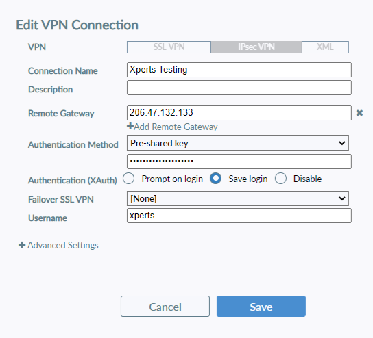
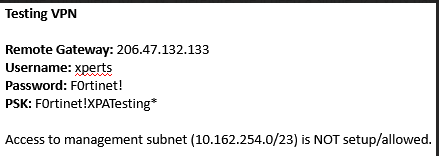
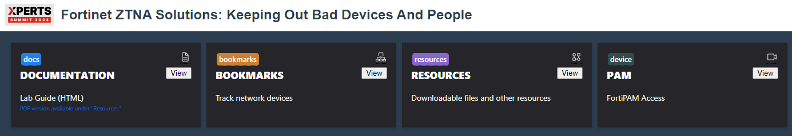
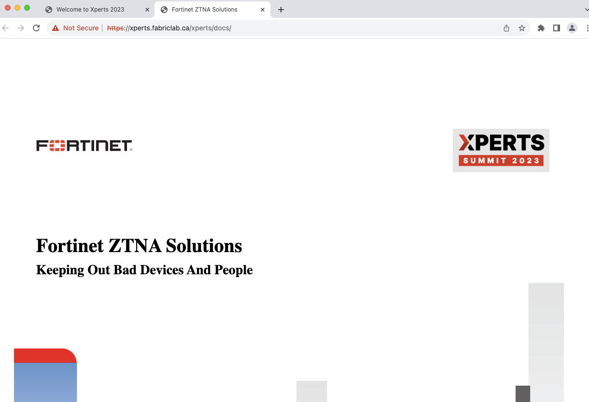
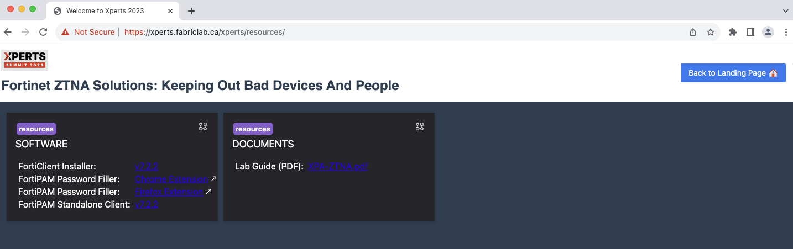
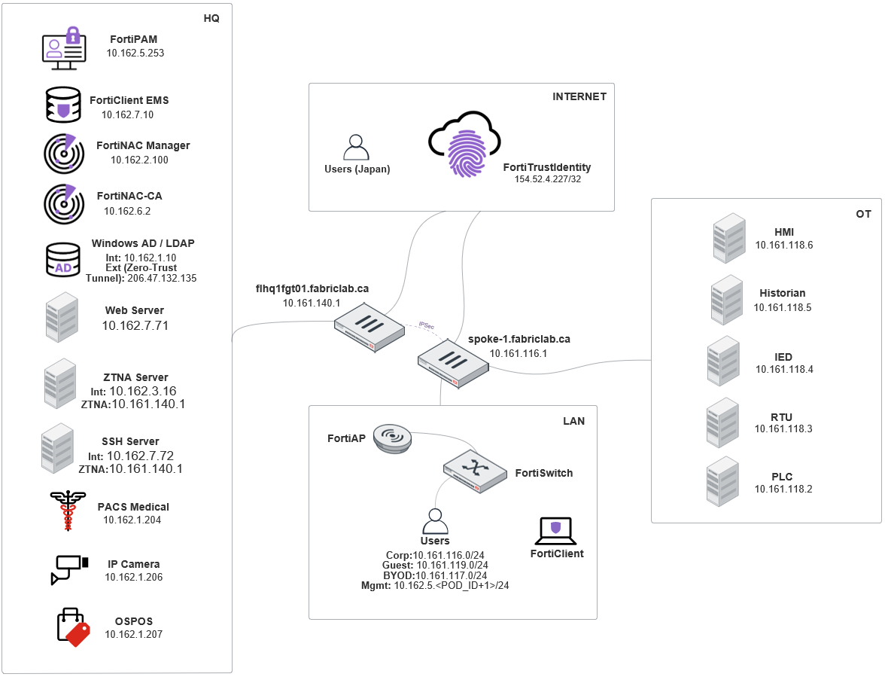

# Welcome to the Xperts ZTNA Track

## Introduction

??? warning "VPN INFO FOR TESTERS ONLY"
    Before you start the lab ou will need to setup a VPN using FortiClient!

    
    

## Getting Started

- Navigate to [https://xperts.fabriclab.ca](https://xperts.fabriclab.ca "Xperts Landing Page")
- **Log in** using your received credentials (student\<POD_ID\> / F0rtinet!)
  - You will need to accept the certificate error

{ width=60% }

## Landing Page

This section aims to show the different options in the landing page, clicking the tiles is not required at this point. They'll be used once you start the actual lab.

- The landing page contains tiles with different options

{ width=100% }

- Open **Documentation** for HTML version of the lab guide

{ width=70% }

- Open **Bookmarks** to access the track network devices
  > Here is where you can **RDP** into the environment

{ width=70% }

- Open **Resources** to access the PDF version of the lab guide and software

{ width=70% }

- Open **PAM** to access FortiPAM

- Open **Hands On Labs** to access the Hands On Labs

{ width=70% }

Credential information:

| Host/User            | Login                                | Password          |
|---------------------|--------------------------------------|-------------------|
| xperts.fabriclab.ca  | student\<POD_ID\> (e.g. student03)   | F0rtinet!         |
| PODs (via RDP)      | MGMT                                 | <*blank/no password*\>|
| SSH Server          | student\<POD_ID\>                    | F0rtinet!         |
| EMS Registration    | student\<POD_ID\>                    | F0rtinet!         |
| FTP Server          | xperts                               | F0rtinet!         |
| IT                  | admin                                | F0rtinet!         |
| Accountant          | admin                                | F0rtinet!         |

___

## Lab Topology

We will be using the environment below to go through the different tasks in the lab.

[THIS IS A HIDDEN COMMENT - REFERENCE ONLY IN CASE THEIR REQUIRED: .]: #