# FortiNAC

## Self Registration

- To get started click on the "Bookmarks" section of the xperts landing page
  
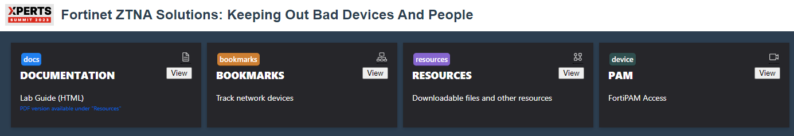{ width=70% }

- Click the Link for NAC-CA
  
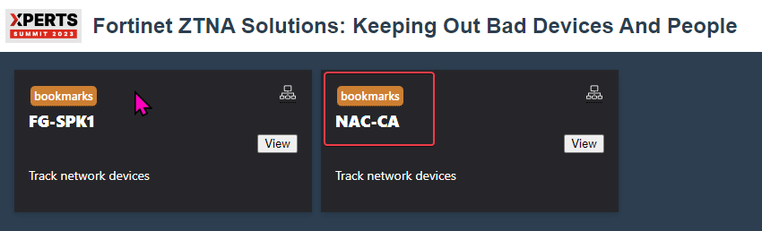{ width=70% }

- Log into the FortiNAC with your student AD credential

> studentxx/F0rtinet

- Go to **"Network / Inventory / SPOKE-1.corp.fabriclab.ca / PODS-1"**
- Sort by **Label** and see the status for your PODs' port (Which is "Rogue")
- Notice when you select a port you have detailed host information at the bottom

 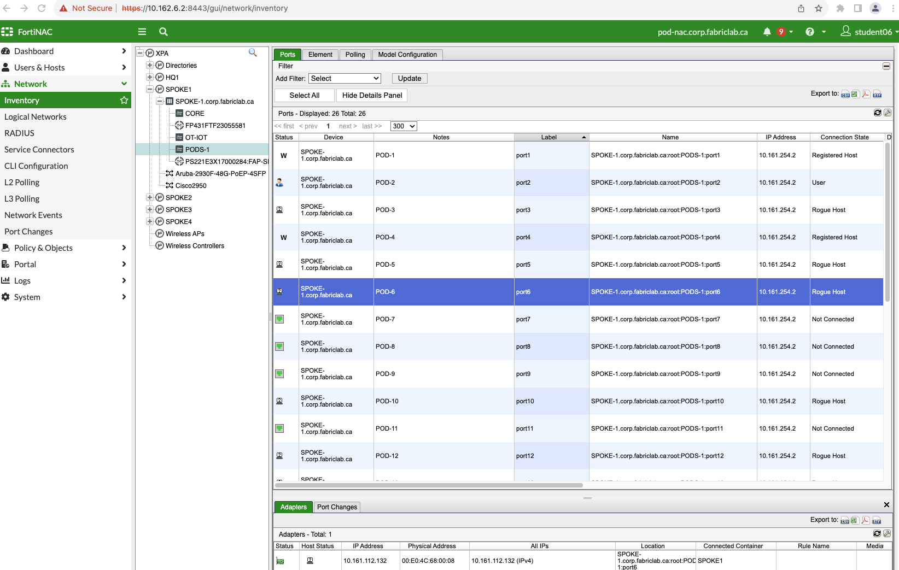{ width=70% }

### Self-Register via Portal

- Use "Remote Desktop" to Connect to your assigned **Windows POD** directly using credentials **"MGMT"** 
There is no password for this user
**If you do not have RDP software on your computer, you can use the PAM Link**

- Once log in your Windows POD. Open **Edge** and select the **"Fortinet"** bookmark
- You should get intercepted by FortiNAC's Captive Portal

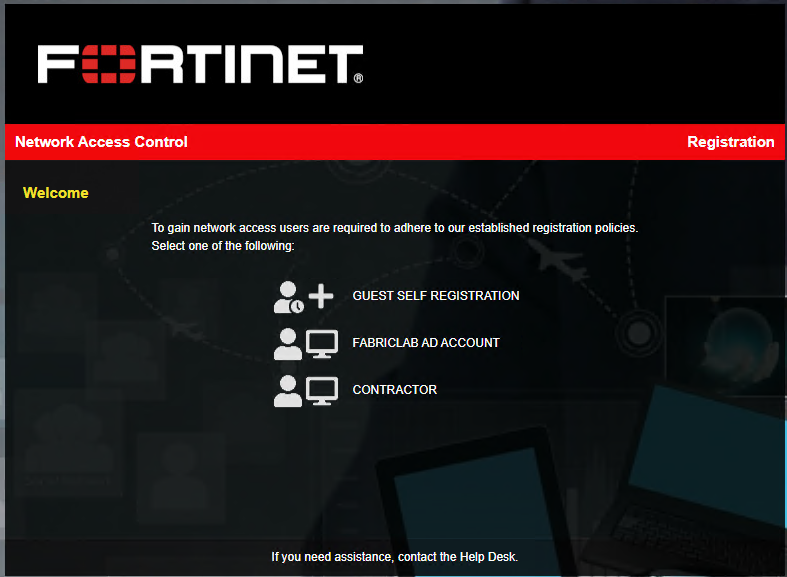{ width=70% }

- Open a **Command Prompt** and type `ipconfig`

> Validate the third octet of the IP address on the Ethernet Adapter containing the **"reg.corp.fabriclab.ca"** DNS suffix
> This subnet is mapped to the device registration vlan and there is limited access until you log into the captive portal
> reg is the short for "registration", so you are in the VLAN that forces you to register.

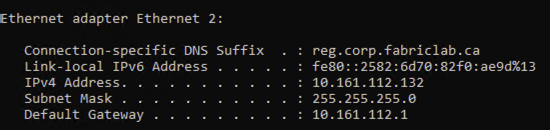{ width=70% }

- Select the **"Guest Self Registration"** option
- Type the information required to register
- For Sponsor type in: **sponsor@fortinet.com** and see if this will work when you submit the request for access

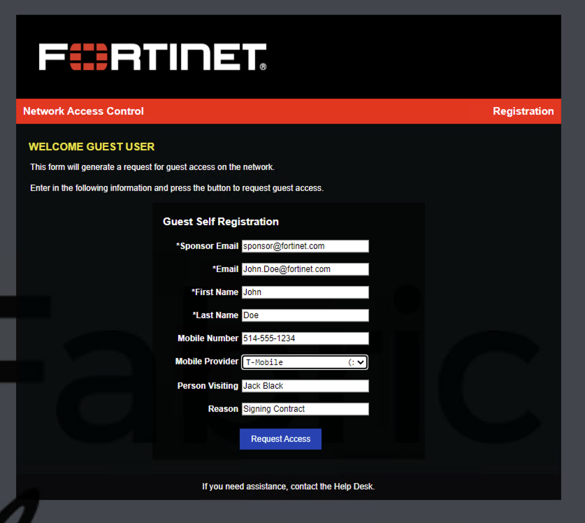{ width=70% }

- You should get an error

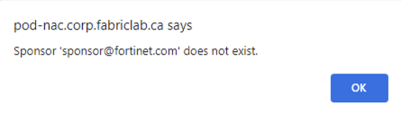{ width=70% }

> This is to ensure that only approved sponsors can receive requests!

- Type in the valid sponsor: **student\<POD_ID\>@corp.fabriclab.ca** (e.g.: student07) and submit your request
- An email was sent to the Sponsor for approval and your status should be pending.

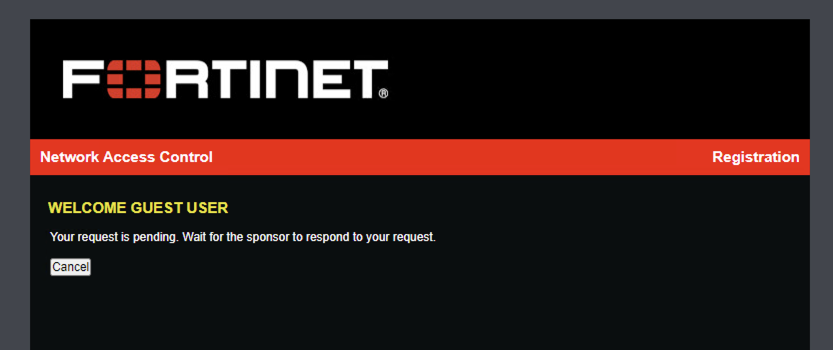{ width=70% }

- Because your student username is a FortiNAC administrator, you can approve the request yourself with or without a greeting message.
- Open **Edge** and click on the bookmark **FortiMail - Webmail** under the folder **Servers**.

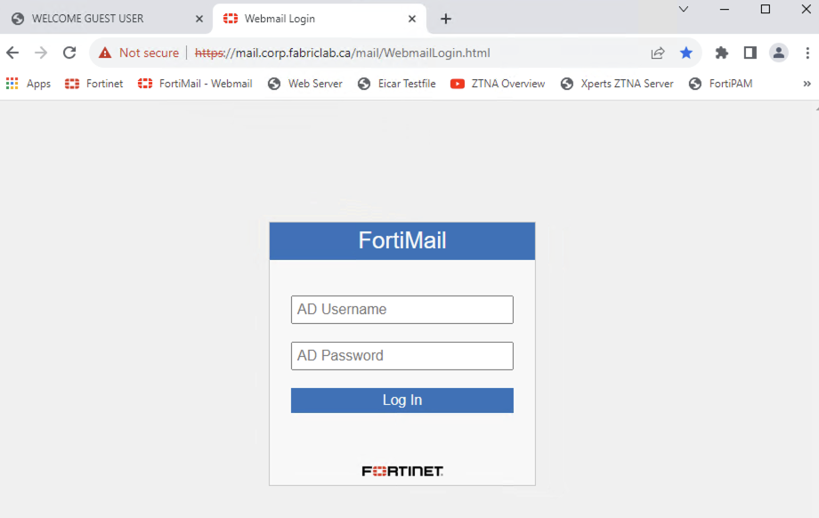{ width=70% }

> If the FortiMail page is not loading, select the FortiMail bookmark again!

- Login with your student credentials (e.g.: **student01** and password **F0rtinet!**)
- Open the received email titled **"Guest Account Request from: Student \<POD_ID\>"**

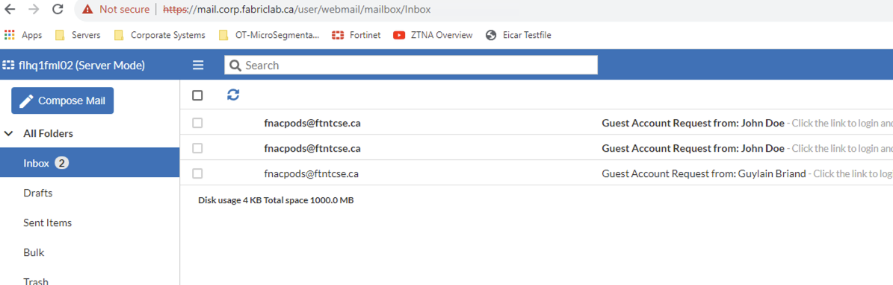{ width=70% }

- Follow the **"Login"** link to approve

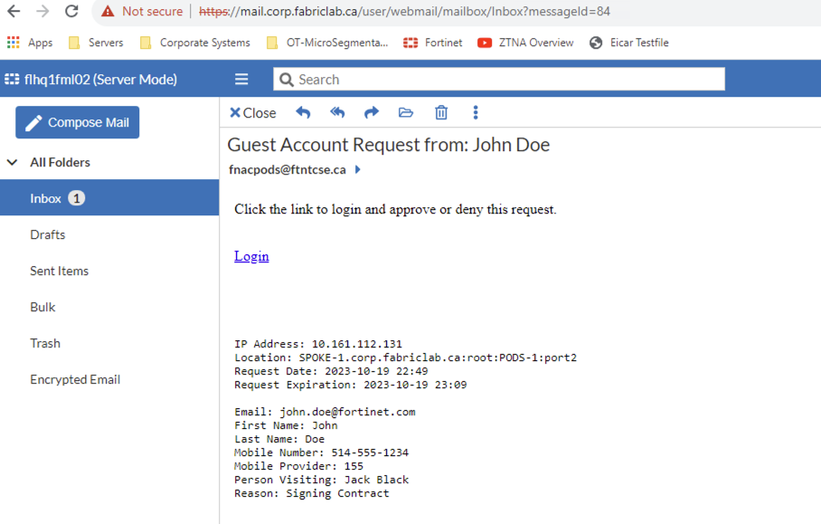{ width=70% }

- Enter password **F0rtinet!** and click **Login**

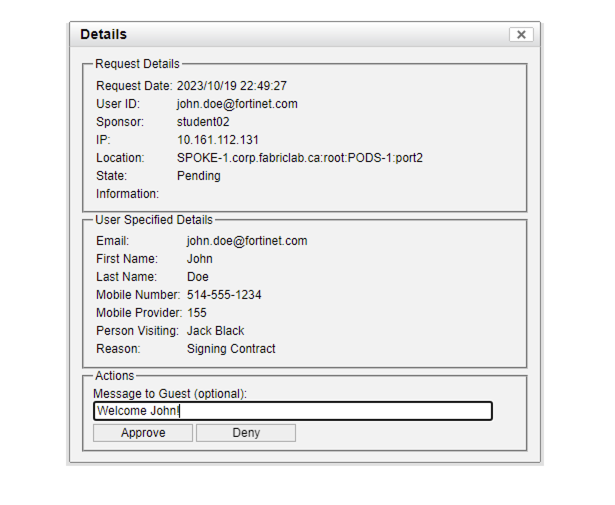{ width=70% }

- Once approved, go back to your account registration screen and click **"Login"**

> Password and username are filled in and the greeting message if you entered one

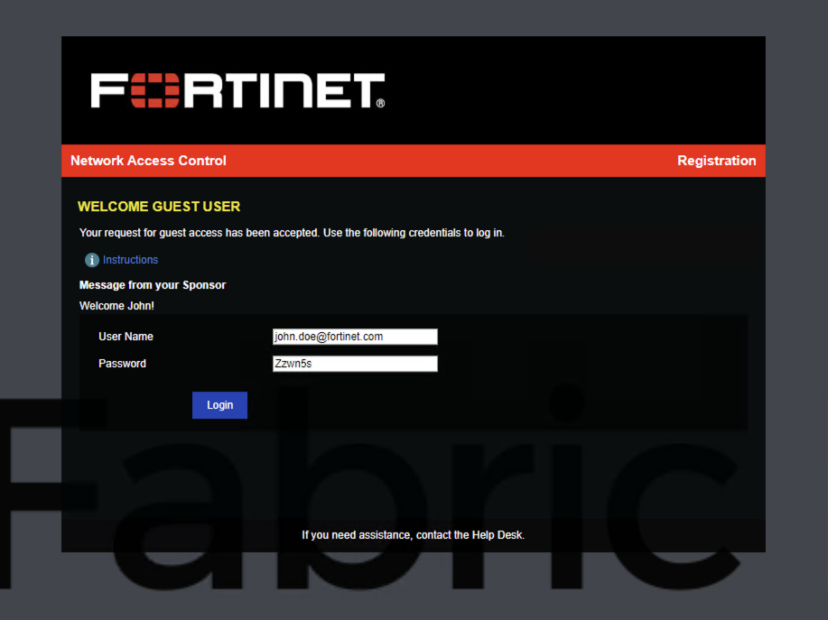{ width=70% }

> In case you see the error below, click **"OK"**
>
> 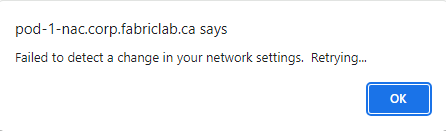{ width=70% }

- Wait for registration to complete and for the redirection to the Fortinet web site
- Open a **Command Prompt** and validate the IP address of the Ethernet 2 adapter

> The DNS suffix is now "corp.fabriclab.ca" instead of "reg.corp.fabriclab.ca"

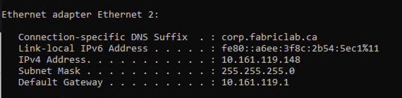{ width=70% }

- Go back to **FortiNAC-CA**
- Go to **"Network / Inventory / SPOKE1 / SPOKE-1.corp.fabriclab.ca / PODS-1"**
- Click on the port and examine the detailed host info, IP address should be the same as in the `ipconfig` output

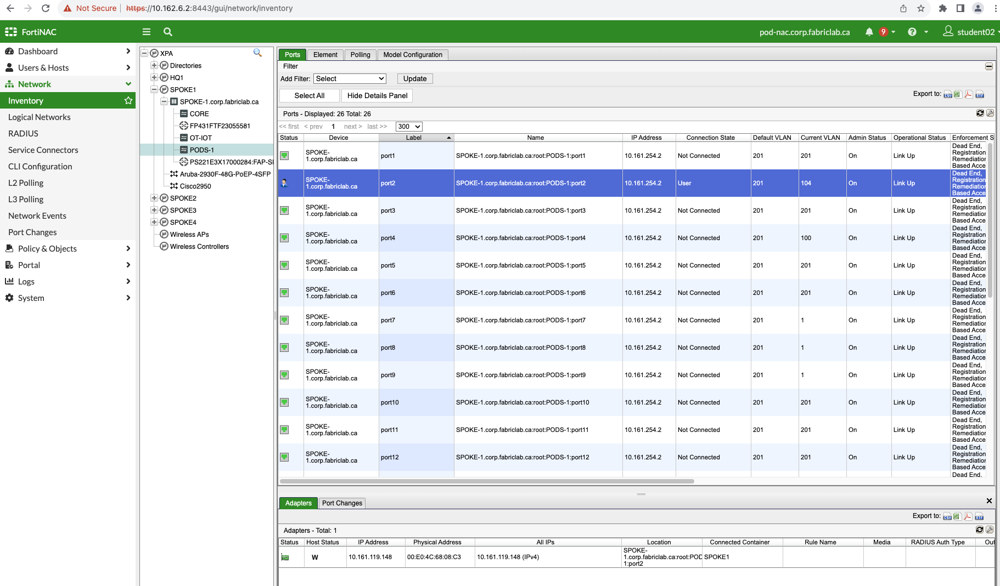{ width=70% }

- Go to **"Users & Host / Guest & Contractor"** you should see all approved guests

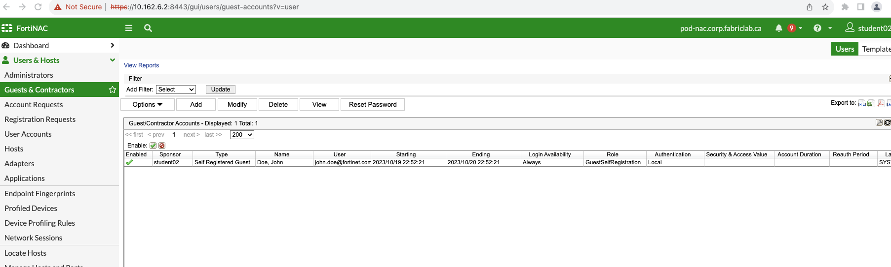{ width=70% }

- Go to **"Users & Host / Account Requests"** to list the history of all requests made on the system

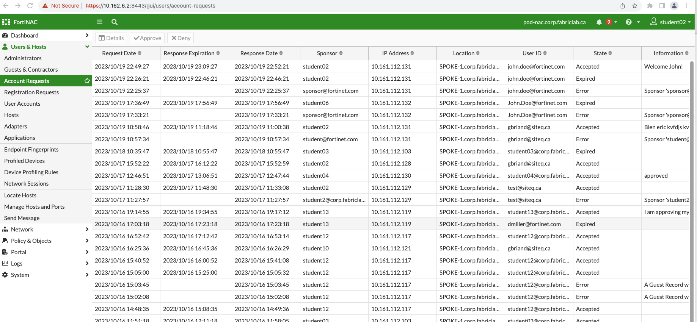{ width=70% }

- Go to **"Users & Host / Hosts"** and find you registered host by searching your POD in the search bar (e.g.: POD-2, POD-* or POD*)

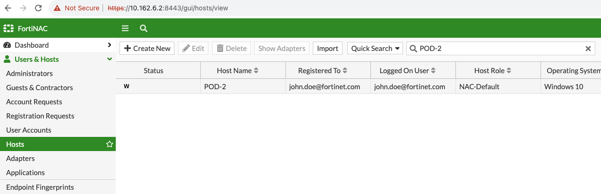{ width=70% }

- Right-click your host and explore the different options
- Choose **"Policy Detail"** to see the Network Access Policy assigned to you

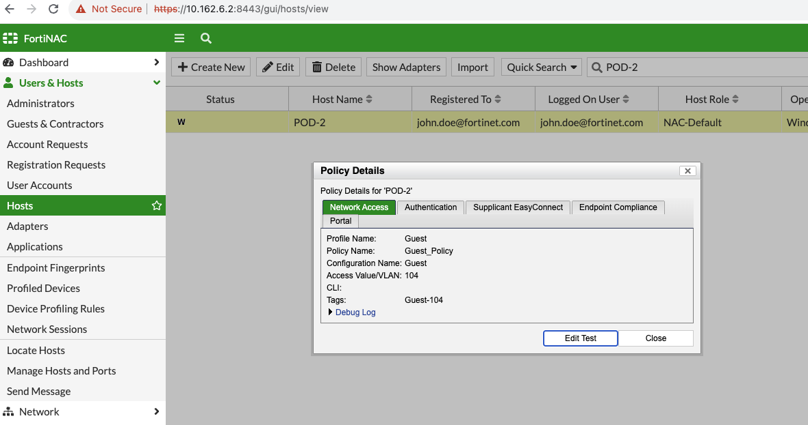{ width=70% }

- Go back to your **Windows POD**
- Try to connect to **Web Server** under the **Servers** bookmark folder

> Any idea why it fails yet? Don't panic you will understand soon!

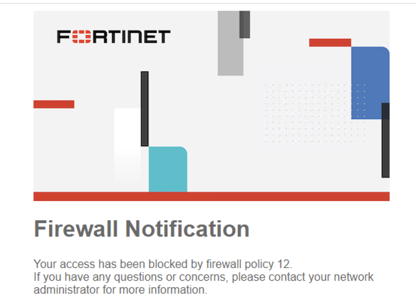{ width=70% }

- Try to connect to the **FTP server** by selecting the **"FTP Server"** shortcut on your POD's desktop
- Enter credentials **xperts/F0rtinet!**
- Type `get guest-tag.txt`
- Confirm file has been saved to **Downloads**
- Type `bye` to end session

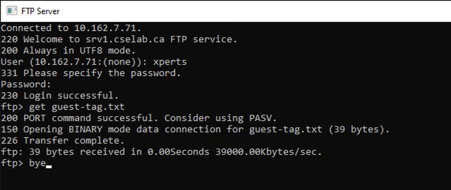{ width=70% }

> Congratulations, you have completed this section and got a new ZTNA tag!

## BYOD-AD

- On your desktop, start the **"MAC-Change"** batch script
- Choose the **"p" (PC from Intel)** option

> The script has changed your MAC address to simulate a new PC so now in FortiNAC you should become a rogue device again!
> You will be moved back to the "Registration VLAN"
> You will not be able to browse anymore and you will be captured by the Captive Portal again
> Be patient as this could take 1 to 5 minutes

- Open **Edge**
- On the Portal choose **"FabricLab AD Account"**
- Register as BYOD with your Active Directory account (student\<POD_ID\>) and wait for the registration to complete

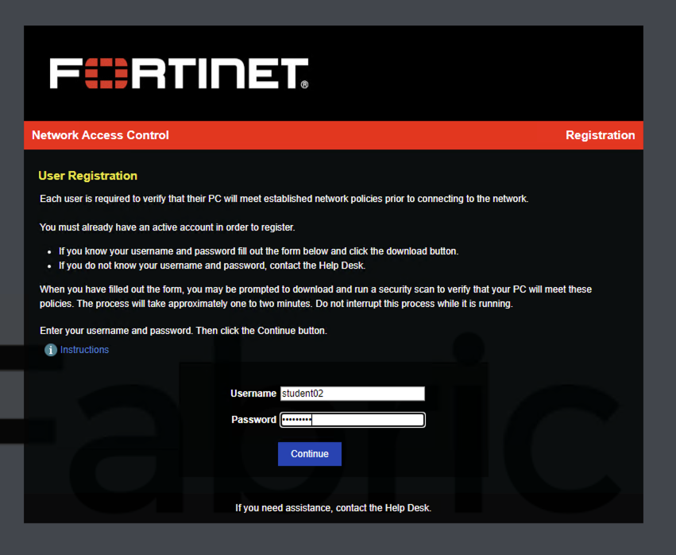{ width=70% }

- If for some reasons, registration failed, refresh the web page again.  It may take a few seconds to complete

{ width=70% }

- After successful registration, you should be redirected to Fortinet's web page
- Open a command prompt and validate `ipconfig` information

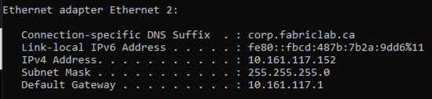{ width=70% }

- Go back to the **FortiNAC-CA**
- Go to **"Users & Hosts / Hosts"**, find your host and validate policy details. Compare assigned VLAN to the VLAN table

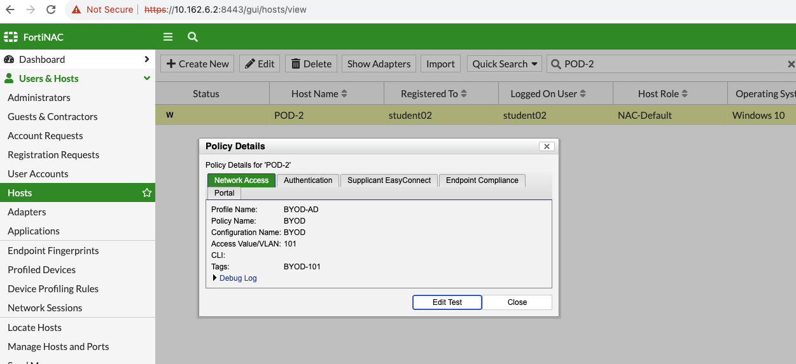{ width=70% }    

  - Go to **"Network / Inventory / SPOKE1 / SPOKE-1.corp.fabriclab.ca / PODS-1"**
  - Filter by **"Label"** and find your port
  - Check the status icon and VLAN information.  You also have all the details at the bottom

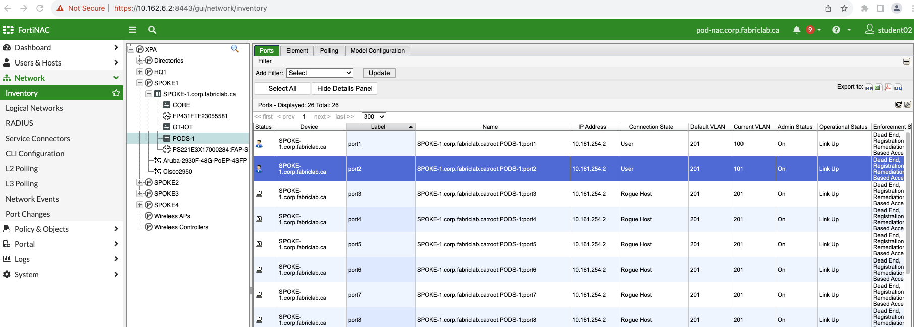{ width=70% }

- From the XPERTS Landing page click on FortiGate **FG-SPK1** link to connect to the FortiGate

- Go to **"Policy & Objects / Addresses"** and review Dynamic Addresses FortiNAC Tags
  - Find what Dynamic tag your POD has, use the search at the top of the screen to enter your IP if you only want to see TAG and information related to you.

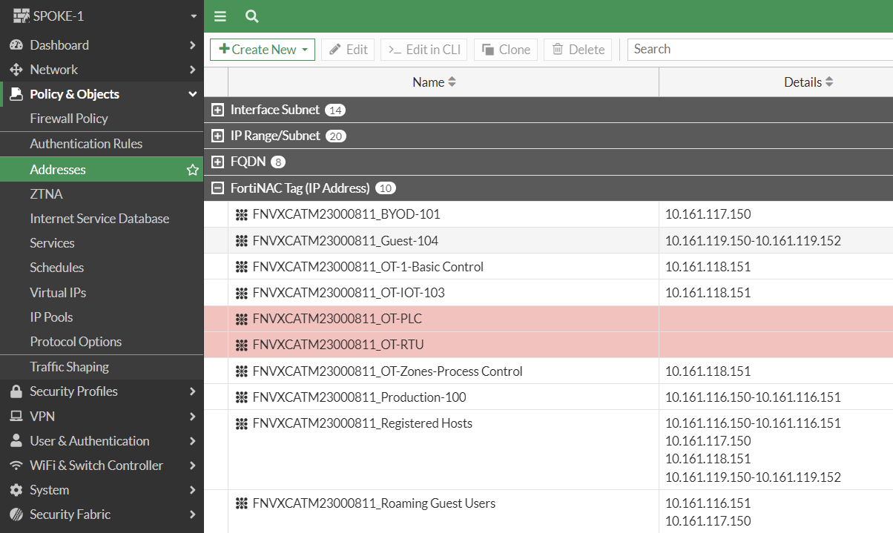{ width=70% }

- Go to **"Policy & Objects / Firewall Policy"** and review FW Rules based on tag
- Review the rule named **"Web Server - Allow BYOD"**

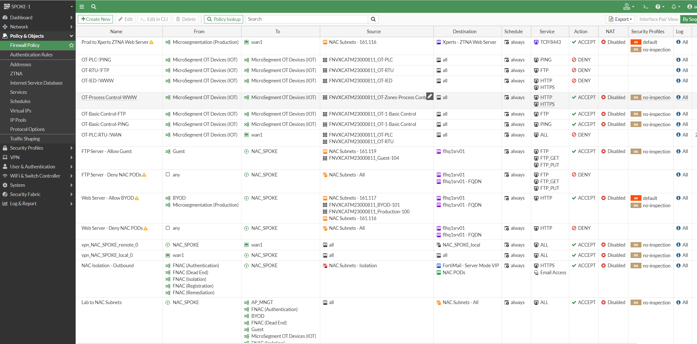{ width=70% }

- From your browser, try again to reach **"Web Server"** from the **Servers** bookmark folder
- Because you now have the proper BYOD-101 tag you can reach the Web Server

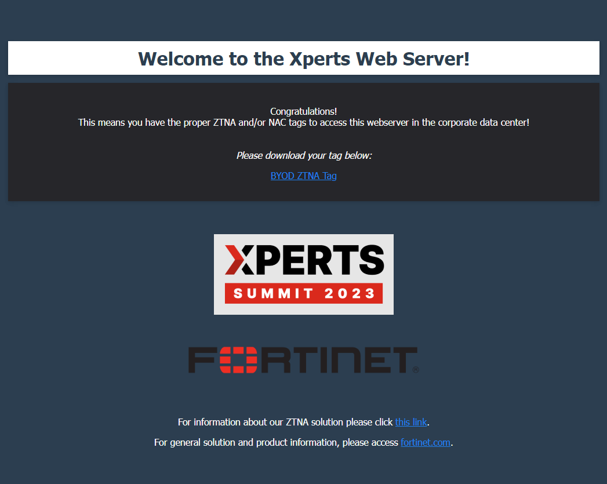{ width=70% }

> Don't forget to save the tag file to your Downloads folder!
> Congratulations, you have completed this section and have a new ZTNA tag!

### Register to EMS

- In preparation for the next lab, retrieve the EMS invitation code from the previously downloaded file **"byod-tag.txt"** in your **Downloads** folder
- Open FortiClient and paste the invitation code to register your EMS client then click **Connect**

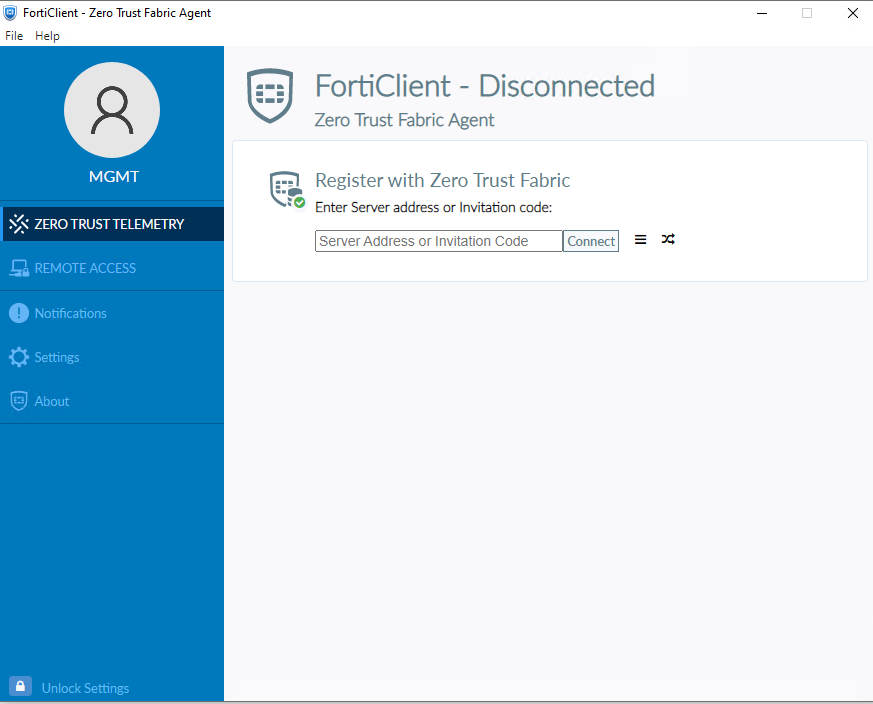{ width=70% }

- Enter your pod credentials (e.g.: student06) in the authentication prompt that will appear

{ width=70% }

- Upon EMS registration your host is now managed by an MDM solution.
- FortiNAC supports many MDM integrations (Intune, EMS, Nozomi, ect.)
- From **FortiNAC-CA**, go to **"Network / Service Connectors"**

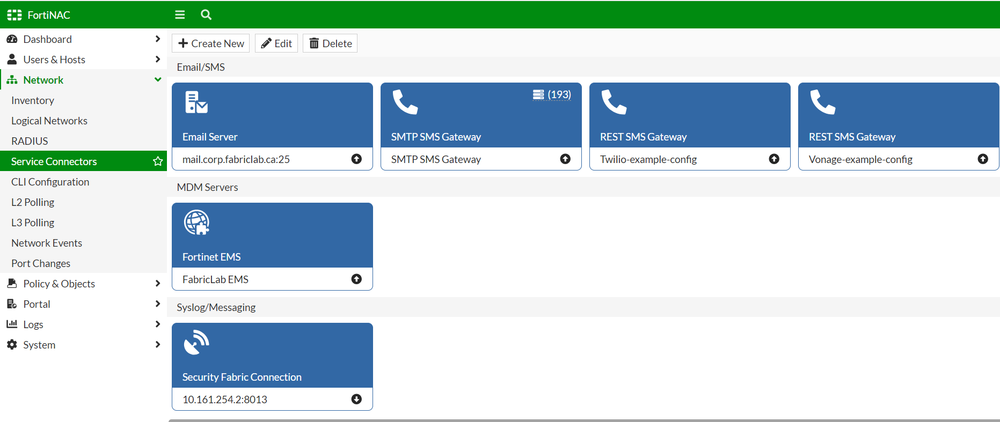{ width=70% }

- Review the Fortinet EMS information

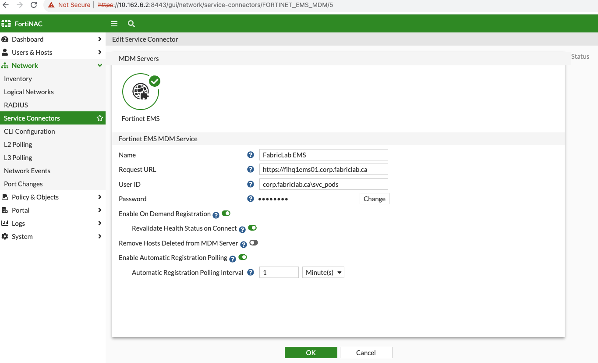{ width=70% }

 - Click **Create New** in the previous screen to see other supported MDMs

 

- On the **FortiNAC**:
- Under **"Users & Hosts"** find you host and see that it now has a green checkmark in the column **"Managed by MDM"**
-- If you don't see the MDM managed column follow step 1 and 2 below

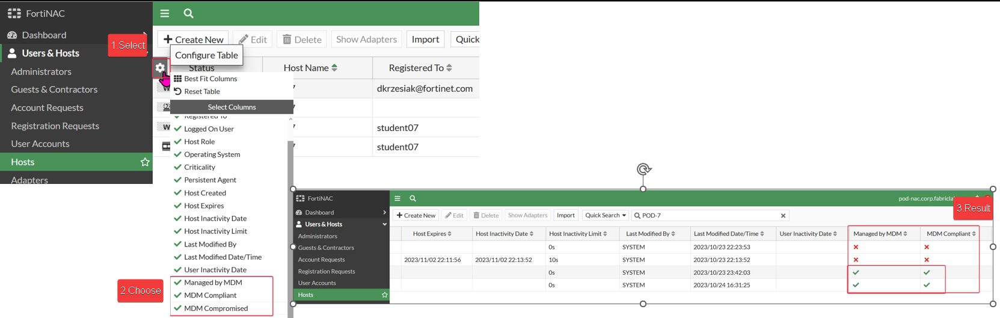

- FortiNAC should now have moved your host into the Production VLAN.
- Go to **"Network / Inventory / SPOKE1 / SPOKE-1.corp.fabriclab.ca / PODS-1"** and filter by Label.

> What VLAN are you on now?

- Review the Policy Details of your host to confirm network access policy

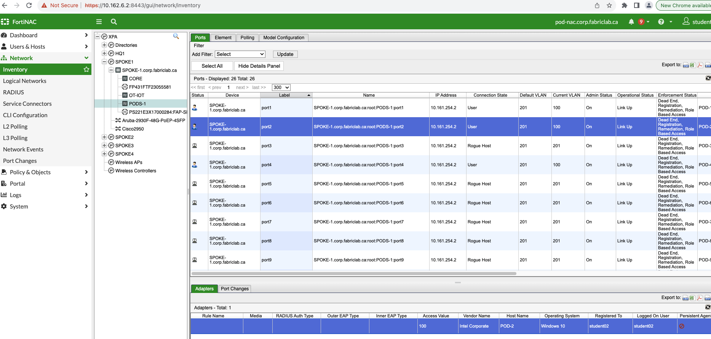{ width=70% }

> If your host has not yet moved you can accelerate this process with a script on your desktop.
> Click the **"Bounce NIC Card"** desktop shortcut to trigger a change of state.

> Congratulations! You have completed this section.
>
> Please [click here](http://flhq1srv01.corp.fabriclab.ca/xperts/tags/gsfg988/) to download your new tag!
>
> <b>IMPORTANT!!!:</b> If you're following this guide from your personal laptop make sure to copy the link and open it from your pod instead for your tag to count!

## Corp Device

- Your Windows workstation is now a corporate device since you are managed by an MDM solution
- Go to **"Policy & Objects / Network Access"** to review the policy
- Review how each device type is given access to the network

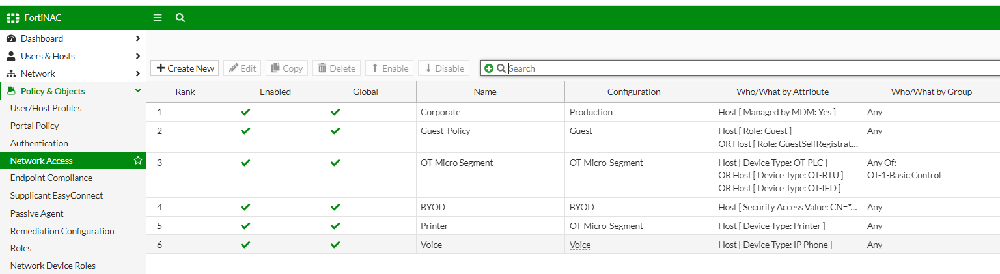{ width=70% }

### Automated Response

- In your POD's browser select the **"Eicar Testfile"** bookmark
- You get redirected to the FortiGate's block page

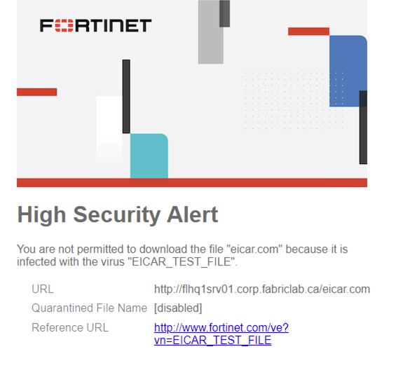{ width=70% }

- Return in **FortiNAC-CA**
- Go to **"Logs / Security Incidents"**
- Review the **Events**, **Alarms**, **Rules**, **Triggers** and open the details of one event to see the attached log from the FortiGate
- You can apply "Filter" if you want to focus on an IP, MAC, ect.

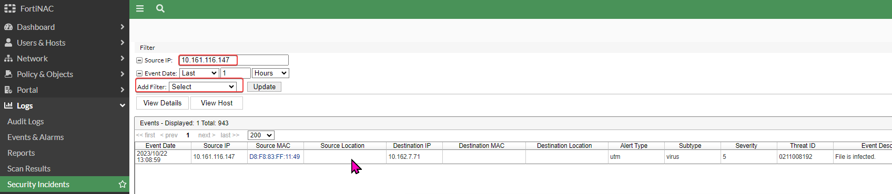{ width=60% }

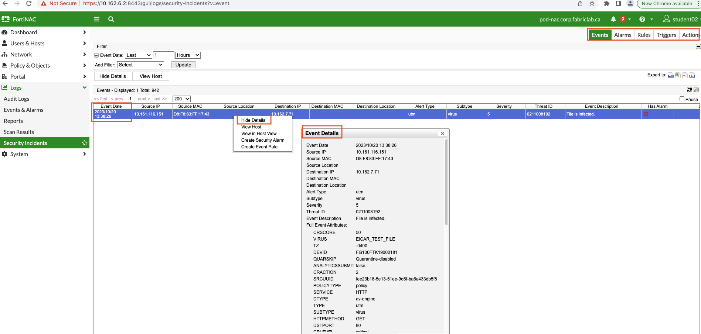{ width=70% }

- Explore the **Rules**, **Trigger** and **Action** tabs to see how this was created and which actions were taken

> In this lab, we simply decided to send an email alert but it would possible to trigger many other actions such as:
   - Move the host to isolation
   - Send alert (Email, SMS)
   - Give a grace period to the user
   - And more.

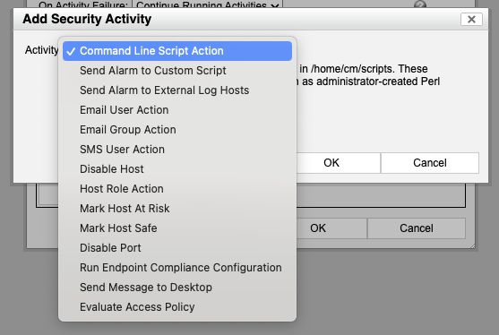{ width=70% }

- Review the alarm

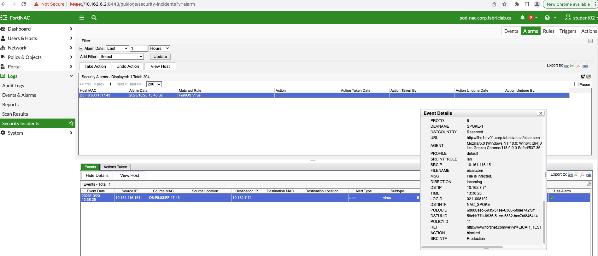{ width=70% }

- This was done via a security event parser, you can use this for all types of events from any security appliance on your network

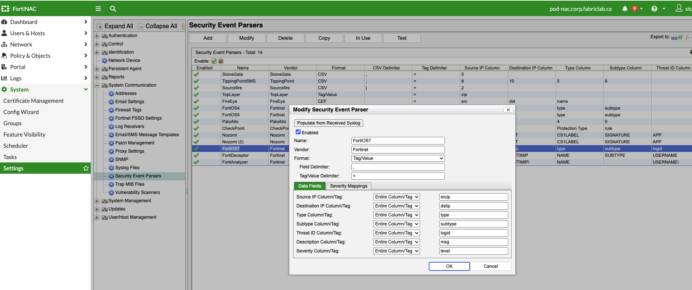{ width=70% }

- Go back to your **POD** and open **FortiMail**.
- To check if this event created an alert, login with your credential.
    - **Username:**    Your student account
    - **Password:**    F0rtinet!
- Check for an email like below:

{ width=70% }

- Review the email and note that it has been triggered by the FortiGate AntiVirus engine.

Congratulations, you have completed this section!

___

## Compliance & Response

In the previous exercise, we have registered the Host to EMS using FortiClient. In this exercise, we will see that FortiNAC also has an agent that can be used for registration and compliance when there is no MDM solutions, like EMS are being used.

### FortiNAC Persistent Age

What it Does

The Persistent Agent resides on the host machine and works in conjunction with the FortiNAC Agent Server to complete tasks such as registration, authentication and scanning,
as well as provide additional information to FortiNAC about the host (adapters,
applications, etc).

Since you are now a "Corporate" device with access to sensitive part of the network it is critical for the organisation to scan your host for compliance to corporate standard.

##### FortiNAC Persistent Agent installation

You will now install The persistent agent on your POD, this agent will allow us to do compliance scan 

- On your desktop click on the **"FortiNAC Persistent agent"** icon to install.
- On FortiNAC go to **"Users & Hosts / Hosts"** and find your POD-XX and verify that you have a checkmark in the "Persistent Agent" column like the one for POD-10 below:

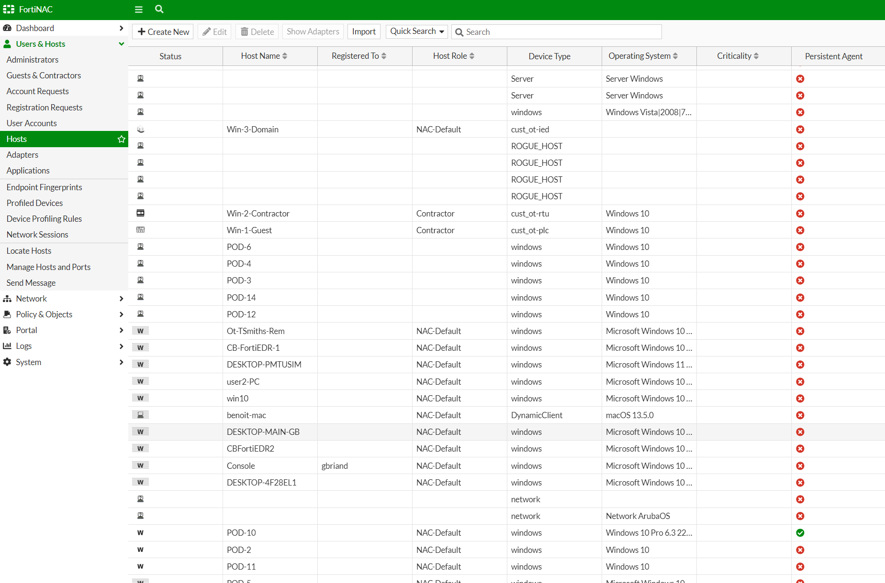{ width=70% }

- You can right-click on your host and send a message
- Right-click again on your host and initiate a **"Scan Host"**

- Now right-click on your host again and see the inventory of all the installed applications

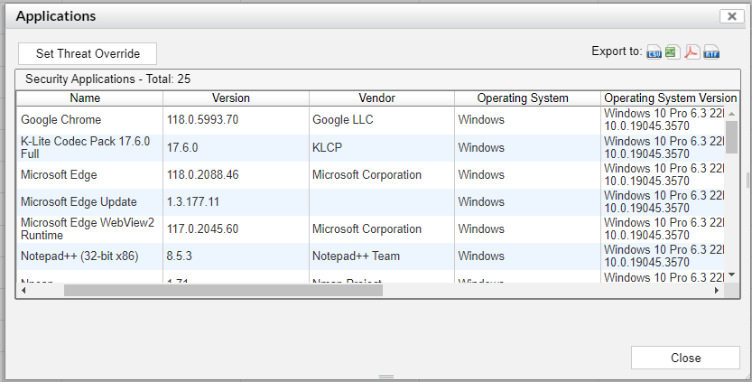{ width=70% }

- You can see the Scan Report for all the host under Logs/Scan Result, make sure to select the time range a click "Update":

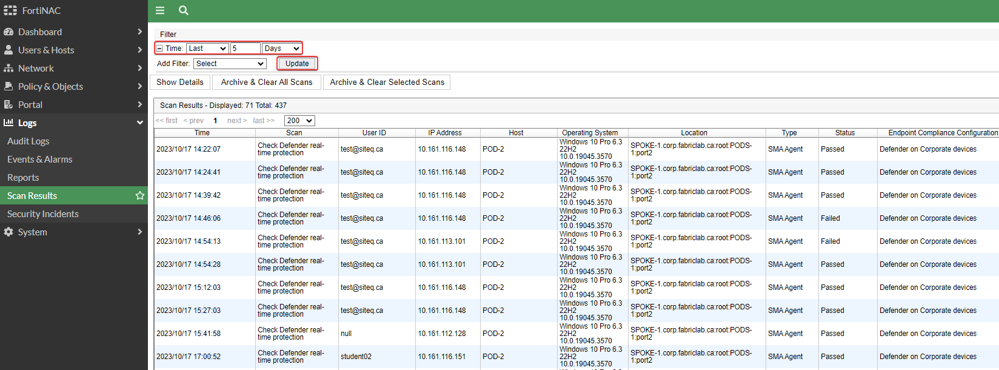{ width=70% }

- On your POD(Windows) Click on the "Windows Security" icon that is pinned to your taskbar

-- Click on the Virus & Threat protection

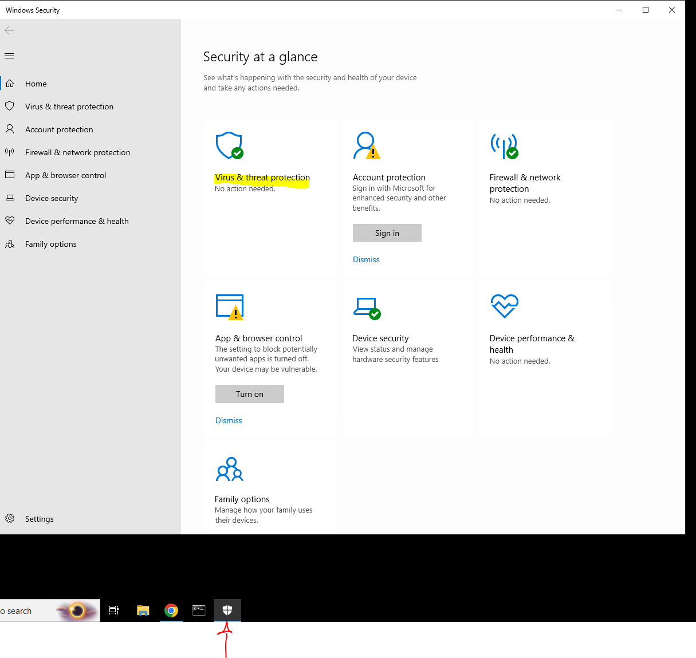{ width=70% }

- Then Manage setting under the section Virus & Threat protection settings
- Disable "Real-time protection"
- On your browser click on the "Video" bookmark and listen to the video

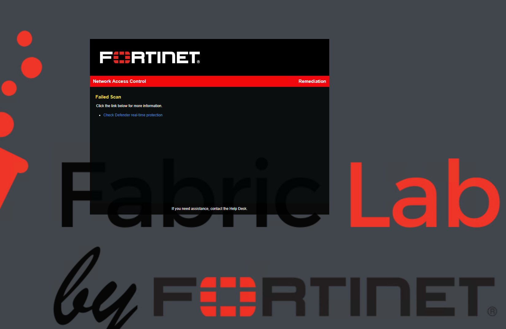{ width=70% }

#### What happened?

FortiNAC agent is verifying every 60 secondes that you have proper protection, when your turned Defender off the next scan made you non-compliant!

- On FortiNAC go to Host and check your Host and notice you have a red cross, this mean you have been "MARK-AT-RISK"
- Go back to your captive portal and click on the blue link " Check Defender real-time protection
- Follow the directive to get out of remediation:

!!! note "OPTIONAL"
    Contractor (Maybe?)

    - To start the new lab as a contractor you will need to generate a new MAC Address using the script(Select PC)
    - Dissovable agent
    

