# ZTNA

Fortinet Universal ZTNA ensures secure access to applications hosted anywhere, whether users are working remotely or in the office.

ZTNA tags are associated to endpoints based on a pre-defined criteria (or several!).\
Those tags get synchronized to other Fabric devices (e.g.: FortiGate, FortiPAM, etc.) and can be used to control access to resources.
Tags are dynamic and constantly checked by FortiClient for changes.
Once changes that satisfy (or go against) one or more pre-defined criteria are detected FortiClient updates EMS, which updates other Fabric devices.

In this section you will need new tags to access different resources (e.g.: PAM target, Web URL, Application servers, etc.)
More on tags after this next task.

## HTTPS Access Proxy (Remote User Access Simulation)

ZTNA access proxy allows users to securely access resources through an SSL encrypted access proxy which enforces identity and posture.
This simplifies remote access by eliminating the use of dial-up VPNs.

A remote user can access an internal resource through an internet-facing IP on a FortiGate, which proxies the connection to the real server in the backend.

> Internal users are also posture-checked for accessing a given server, however, an access proxy server configuration isn't required since they have direct access to the real server through the corporate network.

- Click the **"Xperts ZTNA Server"** bookmark
- Click **"OK"** when the **"Select a certificate"** prompt pops-up

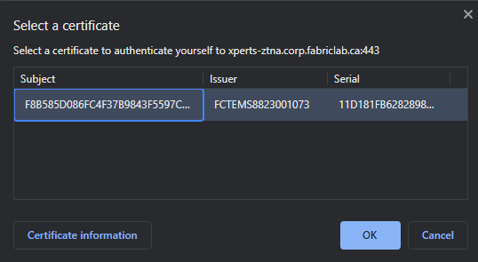{ width=70% }

**What happened?**

Access has been denied based on non-compliance.

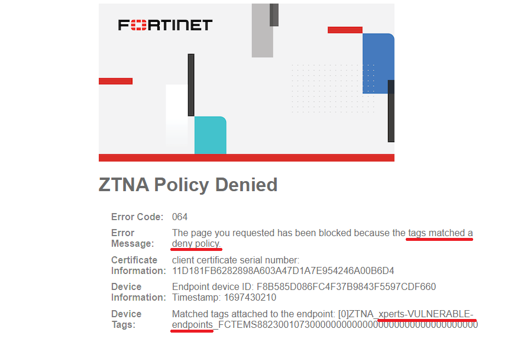{ width=70% }

Your pod is currently tagged as "xperts-VULNERABLE-endpoints" which isn't allowed.\
It has a critical vulnerability that needs patching before that server becomes available.

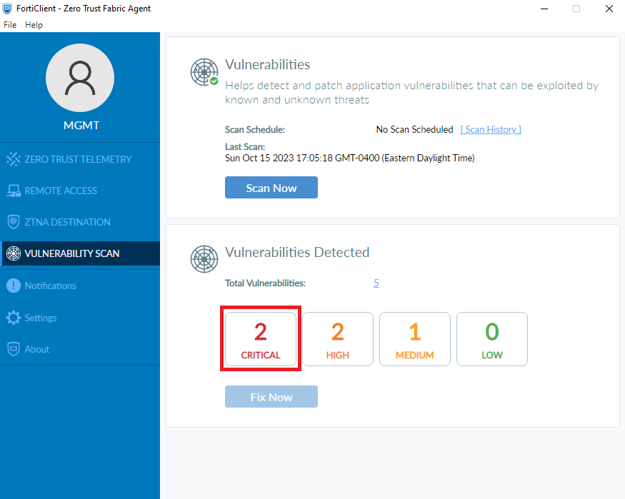{ width=70% }

> Other vulnerability levels aren't being monitored in this specific scenario

- Uninstall **Docker**, the offending application, by selecting the **"Uninstall Docker"** desktop shortcut.
    - You could also uninstall it manually if you prefer.

> The Docker uninstaller for this version has a bug.
> Once you see the error below starting to repeat, please close the command prompt as the uninstall is actually complete and proceed to the next step.
>
> 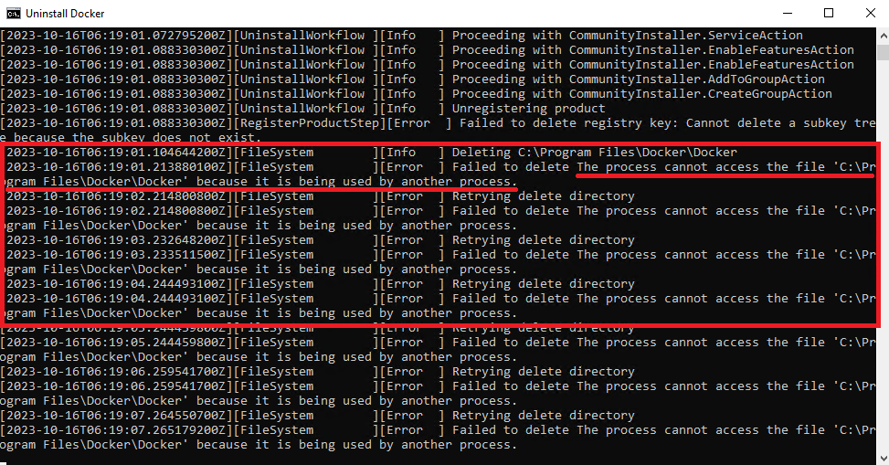{ width=70% }

- Once completed you'll need to rescan your pod
    - Open **FortiClient** and go to **"Vulnerability Scan"**
    - Click **"Scan Now"** (It'll run for about 1 ½ minutes)
- After the scan is complete, close your browser to clear the session
- Open a new window and click on the **"Xperts ZTNA Server"** bookmark once again
- The server should now be accessible!

> Congratulations, you have completed this section and got a new ZTNA tag!

 

**ZTNA Tags**

Tags can be assigned in a variety of ways. A file being present is only one of them.\
This time you got a tag because of your remediation action which turned your device compliant (i.e.: No critical vulnerabilities found).

Here are some of the options:

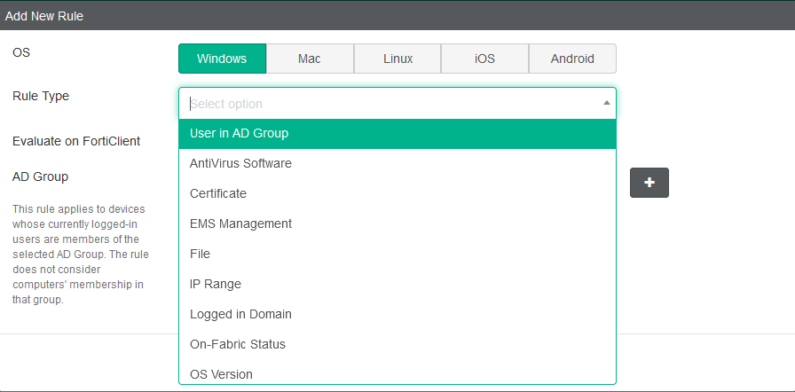{ width=70% }

> Please follow [this link](https://docs.fortinet.com/document/forticlient/7.2.2/ems-administration-guide/342488) for a comprehensive list of the different rule types.

Tagging logic will vary based on business requirements.\
The matching logic can be simple or a combination of different rule types as we can see below:

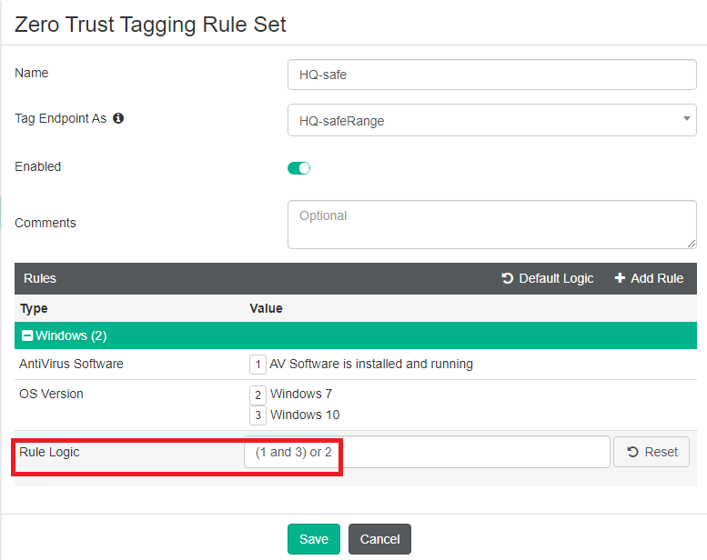{ width=70% }

In it an endpoint will be tagged with "HQ-safeRange" if 1) AV software is installed AND host is running Windows 10 OR 2) if host is running Windows 7.

You now have a few tags that you received in previous labs.

- Open FortiClient from the system tray to see them
- Click the user icon

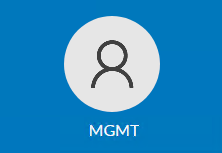{ width=70% }

- Check the section "Zero Trust Tags"

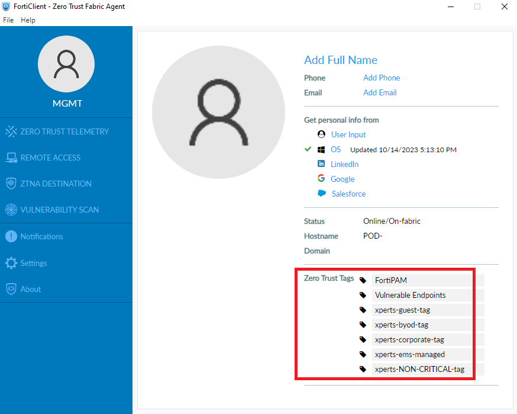{ width=70% }

Some of the tags should be familiar to you as we used them as filenames.

> Notice in the last task you didn't have to download a new file but still got a new tag ("xperts-NON-CRITICAL-tag").
>
> That was also the case for the "xperts-ems-managed" tag you got once you connected FortiClient to EMS.

Those tags and their respective rules have been configured in FortiClient EMS:

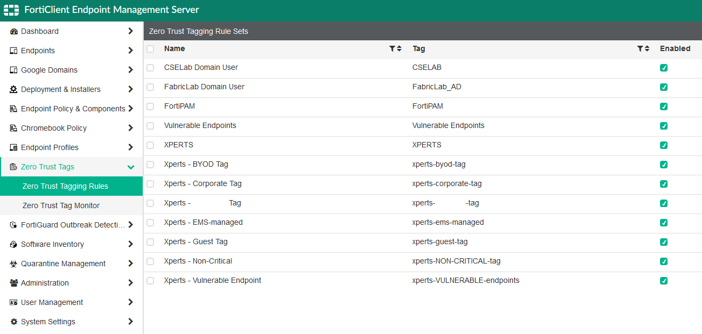{ width=70% }

And they got propagated to FortiGate by EMS:

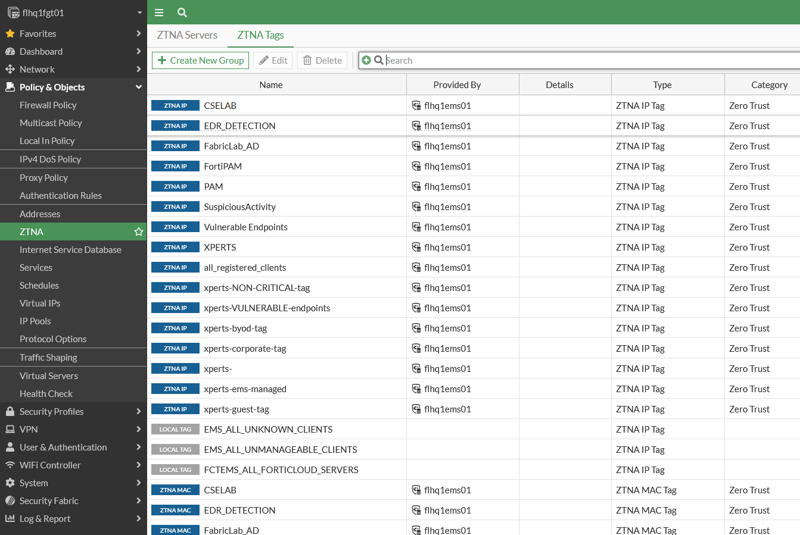{ width=70% }

We used them to setup the ZTNA proxy policy for that server.
First with the "Deny" action:

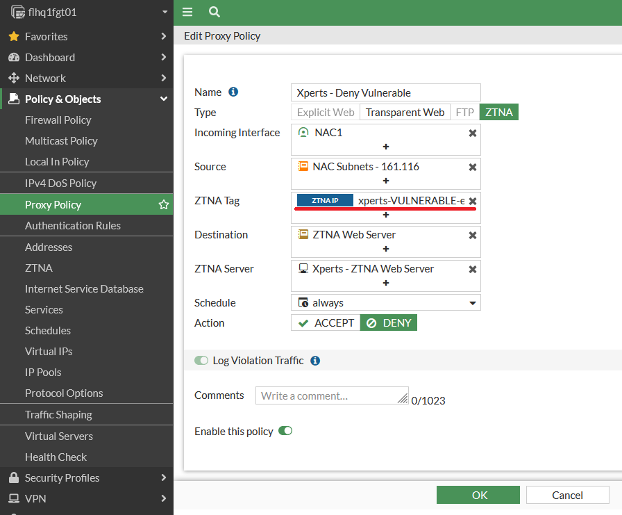{ width=70% }

And then with the "Accept" action:

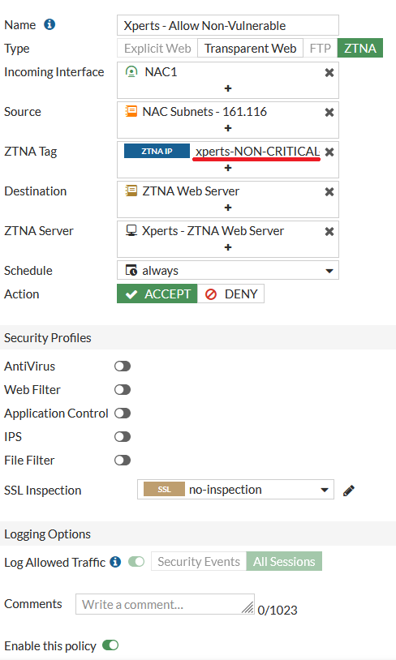{ width=70% }

> We opted for that logic in FortiGate but there is many ways to accomplish the same objective.\
> For example, we could have left "ZTNA Tag" empty in the "Accept" policy and any tags other than the one we previously denied would suffice to access the server.

 

**Extended Authentication**

Here we are not using extended authentication in addition to the default client certificate validation.
Different methods are supported and can be applied to ZTNA policies.
Some of them are basic HTTP, SAML, LDAP/S and RADIUS.
It also allows for OTP/MFA enforcement.
 

***

## SSH Access Proxy with Extended RADIUS Authentication

SSH access proxy authenticates users against a server using a pair of private/public SSH keys.
Upon session start a certificate is generated and signed by FortiGate.
The server validates the certificate, which also contains the username in it, by using the configured public key of the FortiGate.
Both the keys and the username must match for successful authentication.

It provides a seamless SSH connection to the target with advantages over [TCP forwarding access proxy](https://docs.fortinet.com/document/fortigate/7.4.1/administration-guide/101256) such as:

 * Establishing device trust context with user identity and device identity checks
 * SSH deep inspection
 * Optional server's SSH host-key validation
 * One-time user auth to authenticate both the SSH access proxy and the SSH server connections.

All of the above are part of our setup.
Please see topology below. More details to follow:

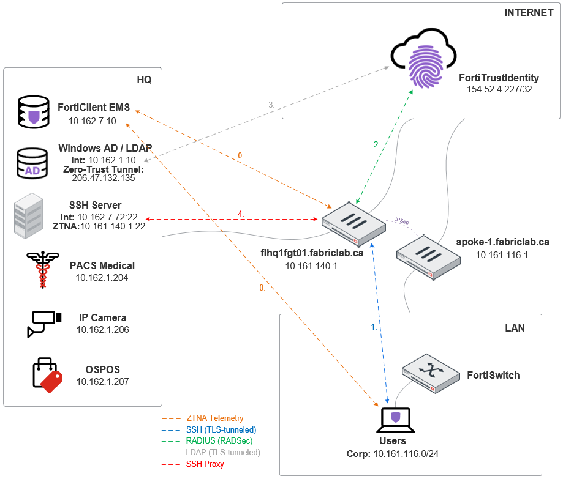{ width=70% }

We're using FortiTrustID to authenticate users via RADSec (RADIUS over TLS).
It connects to the on-prem LDAP for user validation as per flow above.

> For this task you're now an advanced user with some free time that decided to explore the network.
> 
> You've been given SSH credentials in confidence to a server containing backup files from a system admin who worked for the company.

- Open Putty and load saved session **Xperts - ZTNA SSH Server**
- You'll need to **replace "\<POD_ID\>" with your pod information** in the Host Name field before selecting **Open** to start the connection

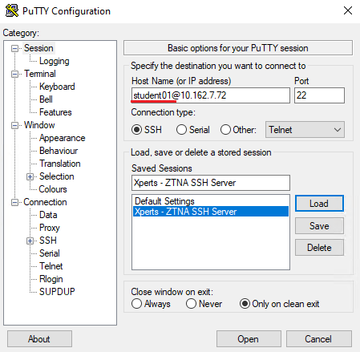

- FortiClient will intercept and proxy the connection
- You'll be redirected to a login screen
- Enter your pod credentials and click **"Sign in"**

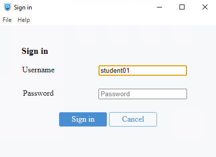

- A "Putty Security Alert" prompt will appear, click **"Accept"**

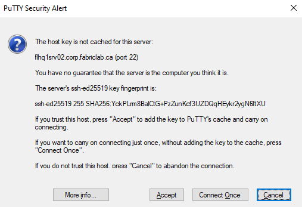

- You're now connected to the server

> The interception occurs due to the ZTNA server destination pushed to FortiClient by EMS.
>
>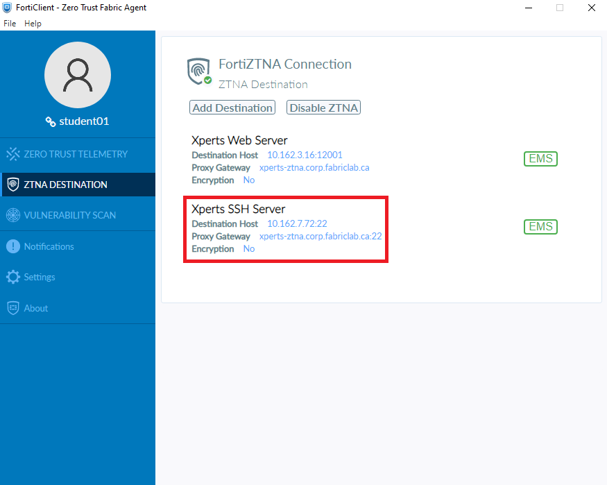{ width=70% }
>
> That means FortiClient redirects the traffic to the "Proxy Gateway" - which is the FortiGate with the SSH Access Proxy configuration - instead of the regular connection that would otherwise go directly to the SSH server.

 

**Extended Authentication**

We chose to use RADIUS extended authentication for added security.

Password-less authentication by leveraging only the SSH key pairs could be achieved by removing the RADIUS Group ("FortiTrustID_RADSec") from the ZTNA proxy policy.

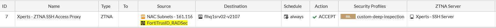

 

> Here is a [bonus tag](http://flhq1srv01.corp.fabriclab.ca/xperts/tags/lhre87v/) to go with that!
> Thanks for participating and for reading through!

- Once logged in type `cd ~/network/refresh/survey`
- List directory files using `ls -lash` and *observe the different files* in it
- Enter `less snmp.mib` and scroll through the file
- You'll find credentials and FQDNs hidden in the end of it
- They'll be used for the next steps
- Try to connect to the systems you found on that file

> We've pre-configured the bookmarks for you

- In **Chrome**, you'll find them under the **"Corporate Systems"** bookmark folder

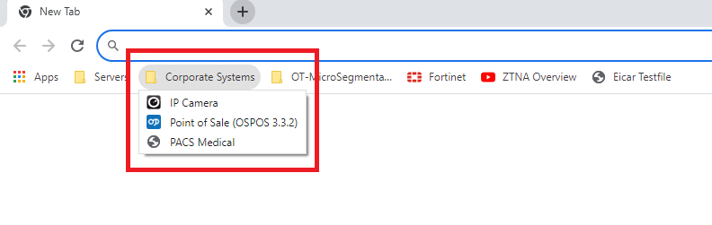{ width=70% }

- Use the credentials to access any and/or all of those systems. Examine their contents and return to this guide after a few minutes

***
 
 
 
 

**What Happened?**

Has anything changed?
Do you see the screen below?

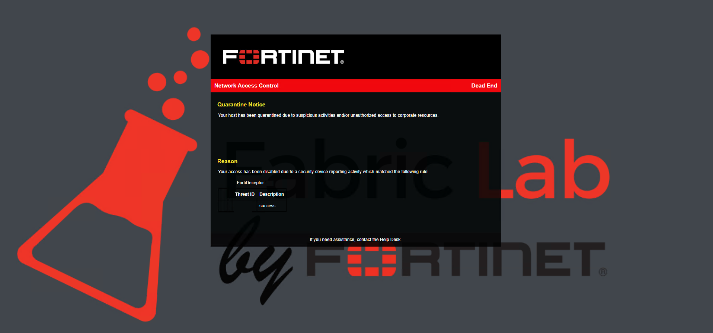{ width=70% }

You lost access to the network. Why?

 
 
 

These systems you found are actually FortiDeceptor decoys or honeypots implemented throughout the network.
You being connected to one of them means you are accessing a system that is unknown to you and, that your presence in it should be cause for concern.

> And that's probably why that system admin is no longer with the company. =)

To detect such behaviors we have created a Security Fabric integration which quarantines any hosts deliberately accessing such decoys.

- Notice now on NAC how you got put in quarantine

> Another option in this case would've been to completely disable the port and cutoff access!

- Open **FortiNAC-CA**
- Go to **Network / Inventory / SPOKE1 / SPOKE-1.corp.fabriclab.ca / PODS-1**
- Find your pod on the list
  > You can filter by "Notes" on top by typing "POD-\<POD_ID\>" (e.g.: POD-14)

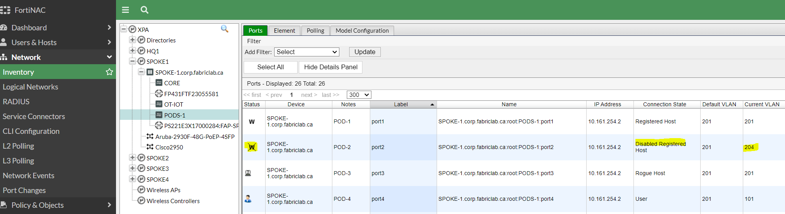{ width=70% }

- Select the line with your host
- It'll be populated in the **"Adapters"** tab on the bottom of the screen
- Right-click the populated information and select **"Enable Host(s)"** from the menu that opens

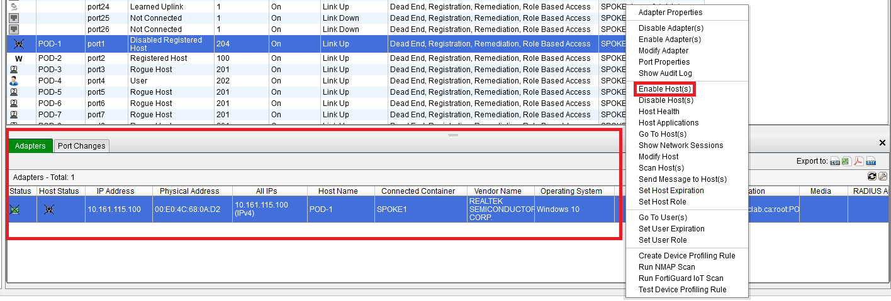{ width=70% }

- Select **"Yes"** to confirm

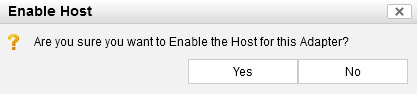{ width=70% }

- You'll soon see your host has been moved back to the corporate VLAN (i.e.: 100)

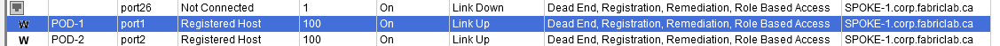

- Give it a couple minutes and your pod should be back online
 

- Another way of releasing the host is by going to **"Logs / Security Incidents / Alarms"**
- Selecting the proper event and clicking **"Undo Action"**

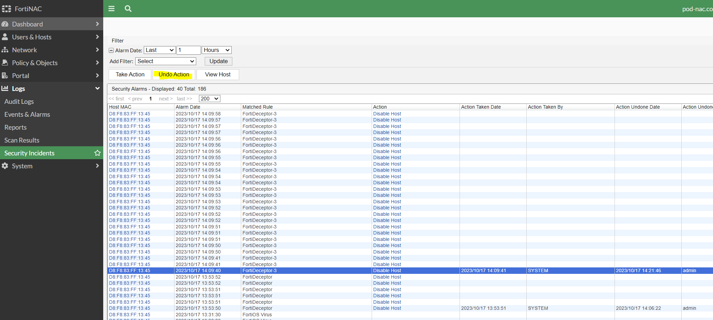

> We have used FortiNAC's integration with FortiDeceptor to quarantine the host.
> Similar results can be achieved by integrating FortiDeceptor with FortiGate, FortiAnalyzer or FortiSIEM.
>
> One way of doing it is by creating a policy in FortiGate which looks for a "bad" tag.
> That tag can be dynamically assigned to hosts based on behavior like in this case and, when they try to send traffic through the FortiGate they get blocked.
 

> Please [click here](http://flhq1srv01.corp.fabriclab.ca/xperts/tags/lkghn94/) to download your new tag!
> Congratulations, you have completed this section and got a new ZTNA tag!