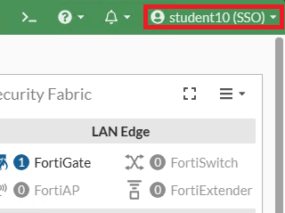

# FortiTrustID

FortiTrustID is a service that encompasses FortiAuthenticator Cloud and FortiToken Cloud

It provides functionality similar to FortiAuthenticator VM or hardware. Refer to the [latest Release Notes document](https://docs.fortinet.com/document/fortitrust-id/latest/fortitrust-identity-23-3-a-release-notes/577670/limitations-of-fortiauthenticator-cloud) (v23.3.a, currently) for limitations

> Please note FortiAuthenticator Cloud **does not** exist as a standalone product!

## Impossible Travel Detection

During this lab we will go through the experience of a user that logs into a FortiGate from Canada and, shortly after, attempts to login from Japan

> Any further logins would be detected if speed of transit is above 500 miles per hour

- Open an InPrivate/Incognito and type **"What's my IP"** in the address bar

- Now on a new InPrivate/Incognito tab, select bookmark **"FGT US-East"**
- You'll be redirected to FortiTrustID
- If you see screen below, accept the certificate error by selecting **"Advanced"** and then **"Continue to 18.222.156.182 (unsafe)"**

- Enter your pod credentials (e.g.: student08) and click **Login**

- You'll be asked for an OTP code, however, we're <u>bypassing it for this lab</u>. Please input any random numbers and click **"Login"**

- Once you're logged in, if you see the screen below, click **"Continue"** 

- If you see screen below, click **"Begin"**

- In the next screen select **"Comprehensive"** and then **OK**

- If a the "What's New" video shows next, select **"Don't show again"**

- Observe on the **top right-hand side** of the screen that you're logged in via SSO with your student ID

 

> Authentication is using SAML against FortiTrustID and your source IP shows "Canada" in FortiToken Cloud (FTC)
>
> 

> All adaptive authentication, which includes "Impossible Travel", is handled by FortiToken Cloud

- Logout from the FortiGate by selecting logout in the **top right-hand side** dropdown menu under your user ID.

- Close the tab and open the **FortiClient** console 
- Go to **"Remote Access"** and enter the VPN credentials (i.e.: xperts/F0rtinet!) and click **"Connect"**

> By establishing the VPN, you're now in Japan!

- We will repeat the previous steps
- Open an InPrivate/Incognito tab and select bookmark **"FGT US-East"**
- Enter your pod credentials (e.g.: student08) and click **Login**

- Send a random OTP code, however, we're <u>bypassing it for this lab</u>. Please input any random numbers and click **"Login"**

- This time you get an error when trying to log in

