# FortiPAM

- From your POD's browser click on the **FortiPAM** Bookmark
-- First attempts will be denied
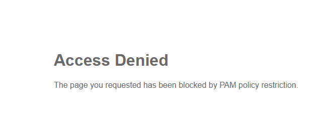

-- This is because your posture on **EMS** doesn't see a specific condition on your computer, or you are not on the proper network, ect. To simulate that we have met the condition, **EMS** will look for a specific file to be on your computer.

- Please open the file explorer and go to the **Document** folder. You should see a certificate file named **FabricLab.crt**
- **Copy or Move** that file to the **Download** folder

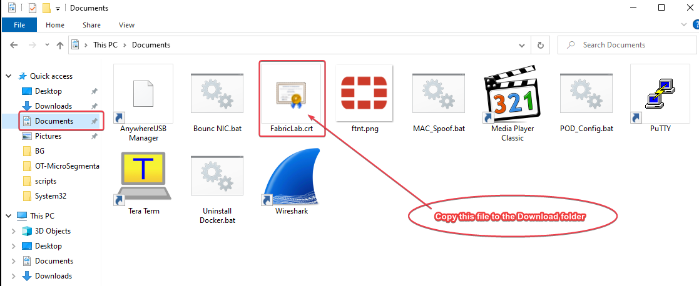{ width=60% }

- Verify on **FortiClient** that you have received the new TAG
- You can see when the next sync will happen with **EMS** and the **TAG** you have here:

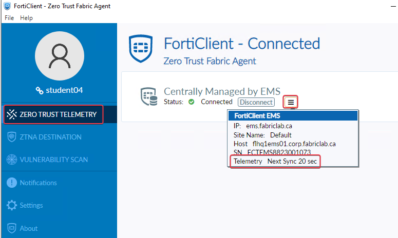{ width=60% }
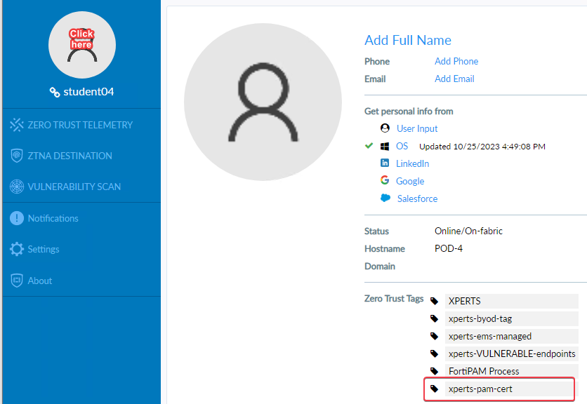{ width=64% }

- Close and re-open you browser or open a new "Private Windows"
- Select(Click on it) the certificate and click **OK**

{ width=70% }

- Login with your student AD credential (studentxx/F0rtinet!)
- Go to **Secrets/Secret List** to see the list of want you might have access

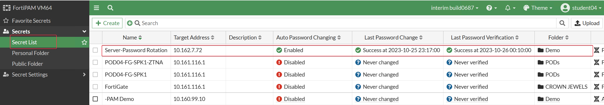{ width=60% }

- Click on the **Server-Password Rotation** and select **Launch Secret** you should have a pop-up like the picture below
- Click on **Putty_v79**
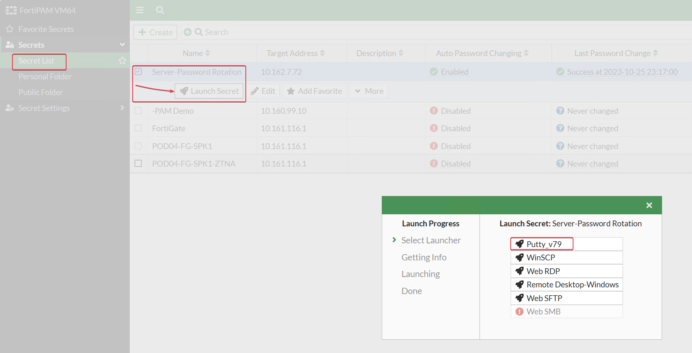{ width=60% }

- You should see an alert that the software you are trying to launch is not on the computer. In this case it is more specific, since we are verifying that the putty version is of a specific version via the HASH verification, and if it is not then we tell you to download it.
- Click the link to download the proper version of **Putty** and then try again to launch the secret

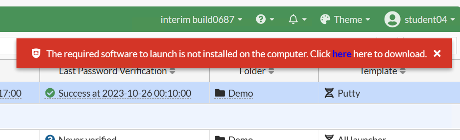{ width=60% }

- Now notice how it successfully started putty and logged you in as **Administrator** without the need for you to know or enter any credentials?
- You can do a few command here if you want
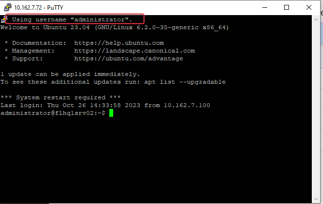{ width=60% }

- Close the Putty session and Click on the Launch again but this time select **Web SFTP**
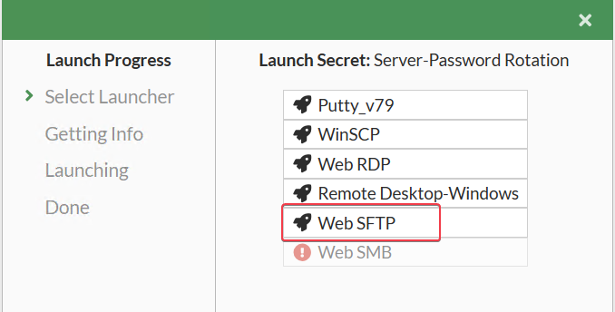{ width=60% }

- If you get a certificate error just accept it.
- Try to download some files to your computer
  - Start with a file with extension **.csv**
  - Then try with a **.txt**
  - Now try to see if you can take a **.exe**

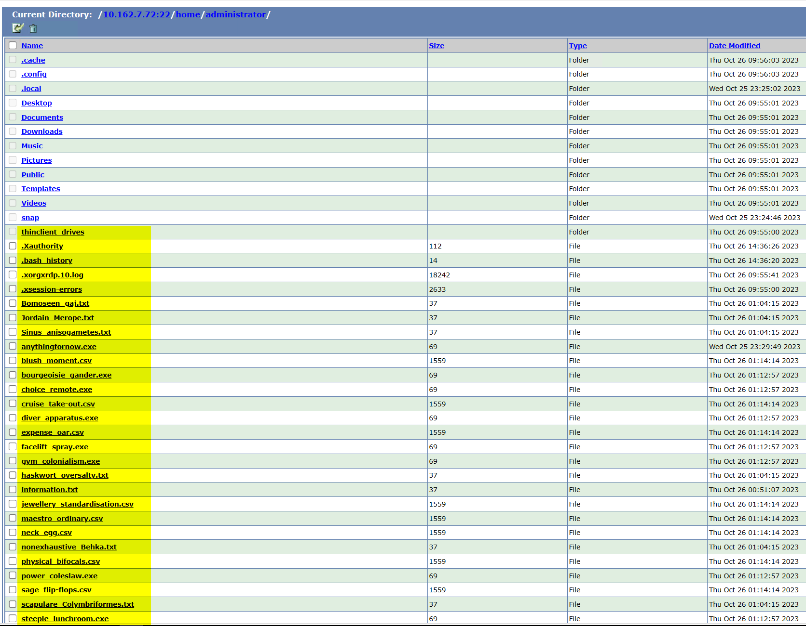{ width=60% }

- If you get the following error it is because **FortiPAM** protected your computer or the server from Downloading or Uploading files that contain Viruses
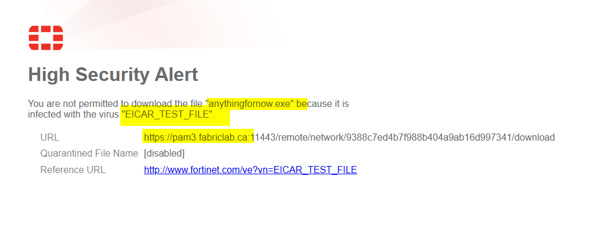{ width=60% }

- Go to **Log & Report/Data Leak Prevention** and explore the logs

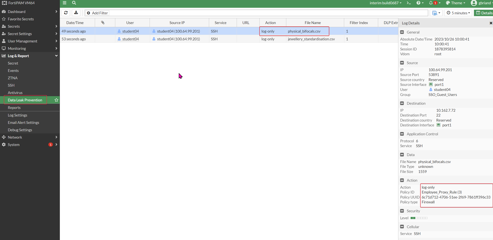{ width=70% }

- **FortiPAM** can inspect traffic and block the exfiltration of documents with sensitive information or simply alert and keep traces of such being downloaded. In this exercise we decided to log any download that contains credit card information.
- Next goto **Log & Report/Antivirus** and explore the logs

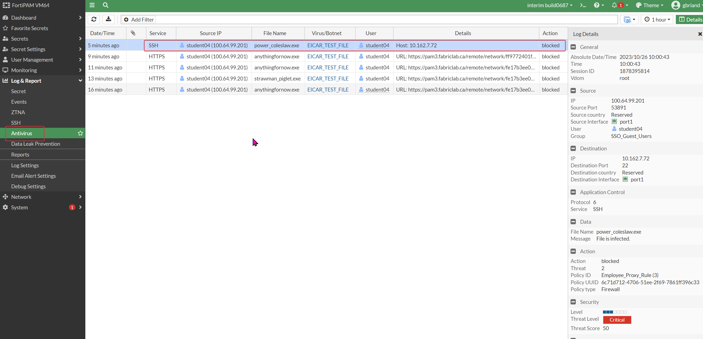{ width=60% }

- Again **FortiPAM** was able to block any transfer of files that contain viruses

{ width=60% }

Connect
