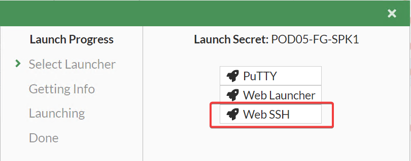

# FortiPAM - SSH

## SSH Filtering

Next we take a closer look at SSH filtering in **FortiPAM**. In this next example we will illustrate how **FortiPAM** can be used to prevent unwanted SSH commands, and how we leverage **Security Fabric** integrations to provide elevated permissions.

- In **FortiPAM** **Secrets**, connect to **POD##-FG-SPK1** and select **Web SSH**
{ width=64% }
- Once connected to the **Web SSH** a new tab should be opened. run the following commands to observe the results.

```text
show
```

- This command should run normally. Press `q` to **quit**

```text
diag
```

**OR**

```text
diagnose sys proxy stats list
```

- Notice how the `show` command ran and `diag` command did not. This is due to the **SSH Filter** preventing the `diag` commands

{ width=64% }

- Now select the **Secret** named **POD##-FG-SPK1-ZTNA** and launch the **Web SSH** **Secret**

{ width=64% }

- By connecting successfully, **FortiPAM** has evaluated your **ZTNA Tags** and has let you connect to the **Secret**

{ width=64% }

{ width=64% }

- Now try running a `diag` command

```text
diagnose sys proxy stats list
```

- Was your `diag` command successful? It will return nothing, but you did not get blocked.

An administrator of **FortiPAM** would be able to see the logs generated from our actions. Below are logs of **ZTNA** events

This is the **ZTNA Access** to the **Secret**

{ width=64% }

We see a log of the **SSH Filter** blocking a command when connected to our **non-ZTNA Secret**

{ width=64% }

After connecting to our **ZTNA Secret** we see a log of the diagnose command being allowed through the **SSH Filter**


{ width=64% }

> Congratulations, you have completed this section!
