# Operation Technology and Microsegmentation

## Concepts of Microsegmentation within Operation Technology Environment

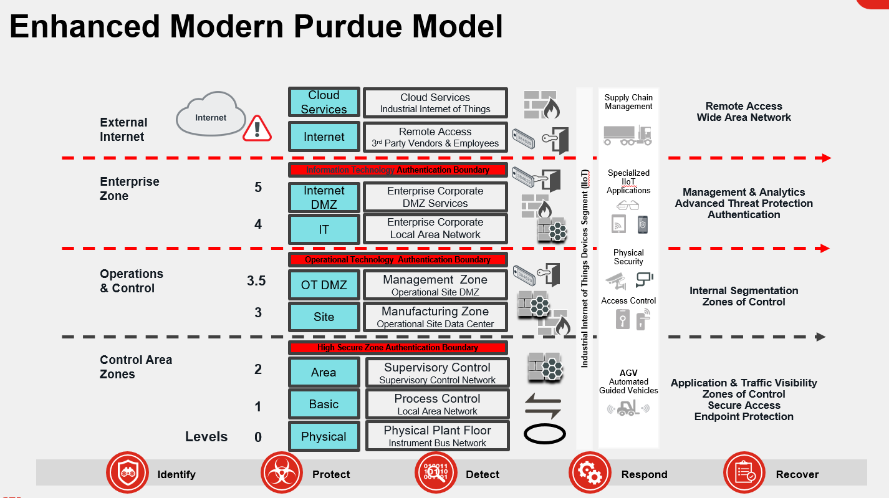{ width=70% }

This shows the **Perdue Model** used within OT environments

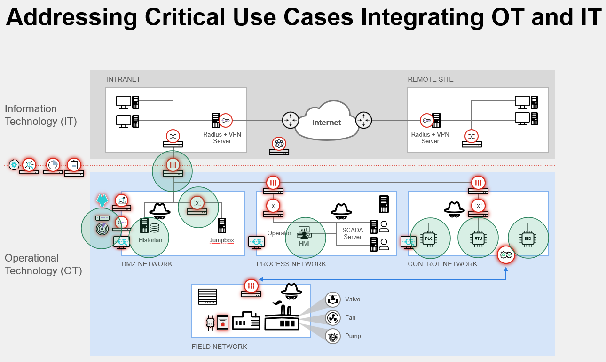{ width=70% }

Integration of OT and OT environments can create unique challenges however though the use of **Microsegmentation** we can work to ensure security of the network and ensure that operational tasks can operate in a secure manner without interruption of devices and behavior within an layer 2 segment.

Within a **NGFW**

Insert screenshot of Configuration

In a O.T. Environment we must ensure that segmentation allows the OT devices to work with devices at the same perdue level. We leverage microsegmentation to ensure devices can only communicate with devices as defined though policy at the appropriate perdue level.

## Microsegmentation for OT Lab (Demo)

In this lab you will live the process of a number of devices within a pre configured OT setup and understand what the device will perceive as well as understand the concepts of the Microsegmentation within the Demo infrastructure within the FabricLab XPA

The lab architecture is shown in the diagram below:

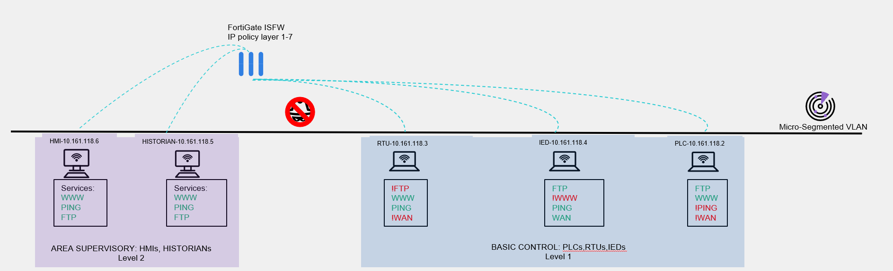{ width=70% }

This is correct, everything is on the same VLAN! but the magic happens in the configuration of the **FortiGate** and **FortiSwitch**, more on that later!

The services allowed from each type of devices are listed under each device and it is like this:

OT Device         WAN    HTTP    FTP   PING
--------------   -----  ------  ----- ------  
PLC                N       Y      Y     N
IED                Y       N      Y     Y
RTU                N       Y      N     Y

For example the PLC's are able to browse on local subnet and reach other devices web pages but are not able to surf the WEB or PING, lastly the PLC's are also able to reach the FTP server.

The **MAC_Changer batch file** will allow your computer to replicate the MAC of a number of devices.

Each time you change your MAC you will be re-profiled by the **FortiNAC** and your Dynamic TAGS will also reflect on the **FortiGate** firewall policies and dictate what services you can reach as per the table above.

___

### Preparation

1. Since OT device typically don't have any agent installed on them let's remove at least **FortiNAC agent**
    - You can stop the service **"FortiNAC Persistent Agent"** or
    - Un-install completely the software
2. Locate the shortcut on your Desktop **"MAC_Changer"**

3. Select Option 3 to change your POD into a **Remote Terminal Unit(RTU)**

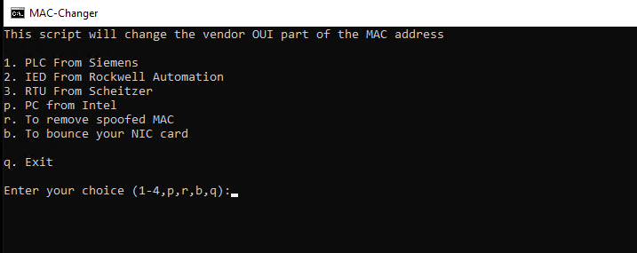{ width=70% }

     - Under Network/Inventory you should see your port show the icon of the OT device you just selected.

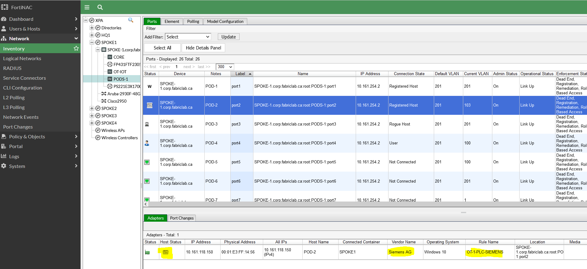{ width=70% }

    - You can validate under  User&Host/Host the policy that now match your device. It is normal to see multiple host entry for your POD since you have registered multiple MAC address with different role(guest, BYOD, Corporate) and now as a PLC

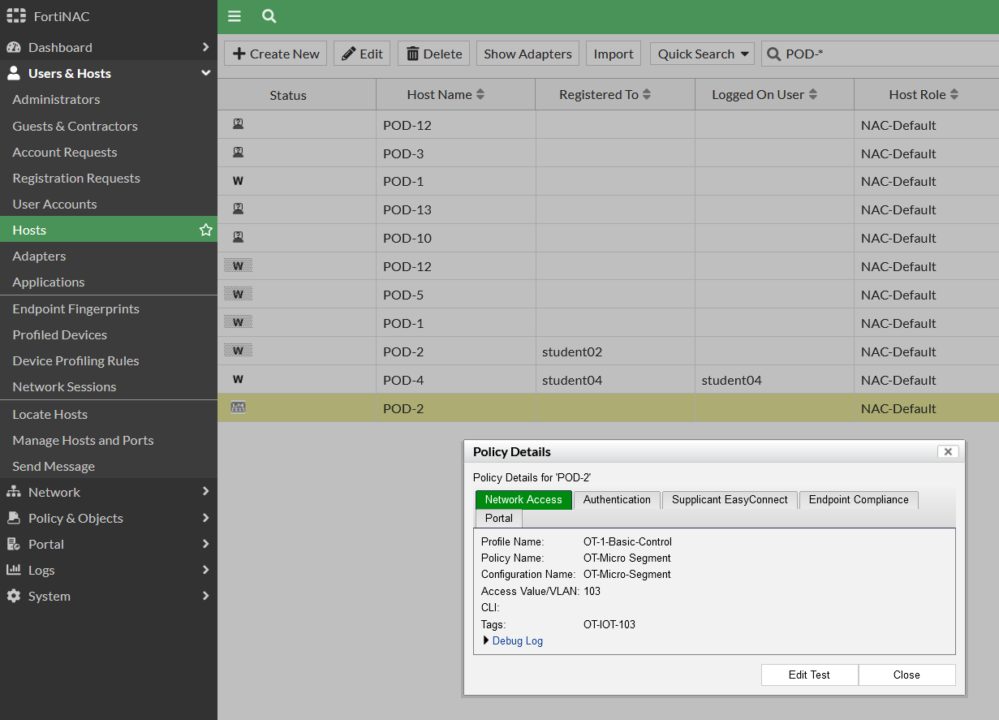{ width=70% }

First you will try to use your browser to surf the web and other machine on the network.

- Open Google and notice the **OT-MicroSegmentation** folder in the bookmarks tab.

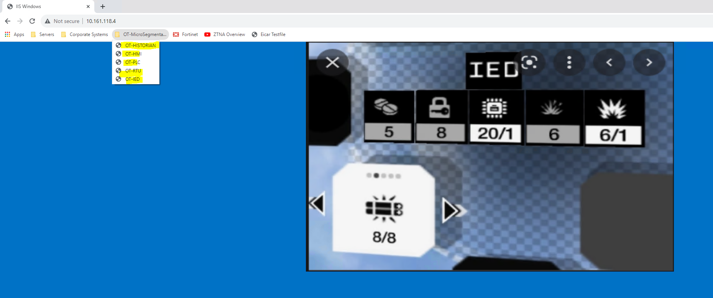{ width=70% }

    - Try connecting to other device on your network(PLC,RTU,IED,HMI,HISTORIAN)
    - Try surfing the WEB

Did you succeed? Do you understand why?
You can go to the **FortiGate** to see the policy that is responsible for blocking or allowing your traffic
Also see the Dynamic TAG under **Policies & Objects/Addresses**

Now try with the other type of services....

To make you life easier we included shortcut to **PING** and **FTP** to both servers in the **OT-MicroSegmentation** folder

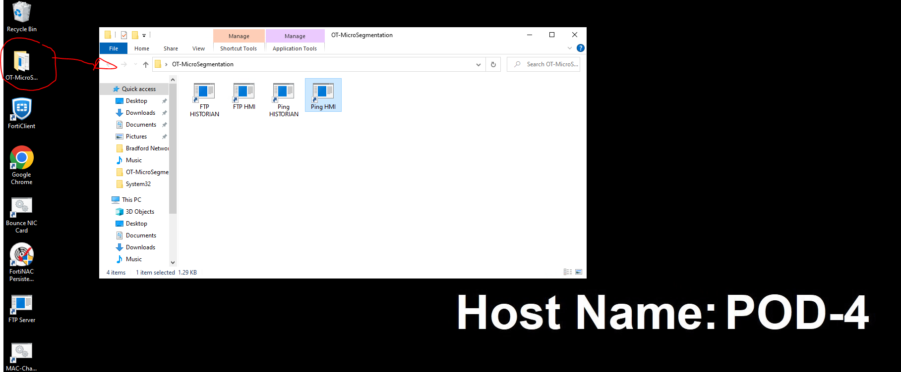{ width=70% }

4. Perform actions to validate the access you have
    - Can you **PING** the **HMI** and the **HISTORIAN** ?
    - Can you **FTP** to the **HMI** and **HISTORIAN** ?
    -- Login with **"anonymous"** and **no password**

Now repeat the step above to become a **PLC** and an **IED**.

>NOTE: If you are able to connect to the **FTP** server make sure you retrieve your **TAGS!!!**

- Review the XPA-Spoke1 **FortiGate**
- Under **Wifi and Switch Controller** go to **Fortiswitch** vlans and review the configuration of the **MicroSegment OT Devices (IOT) Vlan**
-- Do you see the setting responsible for this?
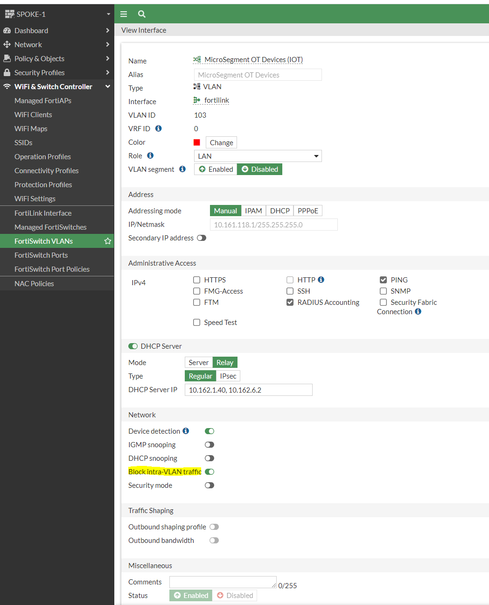{ width=70% }

#### Details

**Block Intra-VLAN traffic** is a feature that force all traffic to go up to the **FortiGate**, it then need to match a policy to go back down to the same Interface or anywhere else. If you combine this with the **Dynamic FortiNAC tag** you have a powerful solution to only allow very specific traffic for every type of device on your network

1. Under **Policy and Objects** go to **Addresses** and review the **FortiNAC Tags** e.g **(OT-IED)**
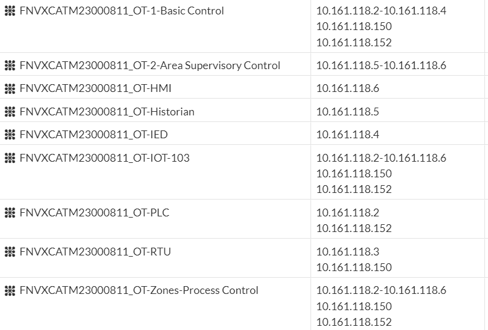{ width=70% }
2. Under **Policy and Objects** under **Firewall Policy**. review the polices for **OT devices**
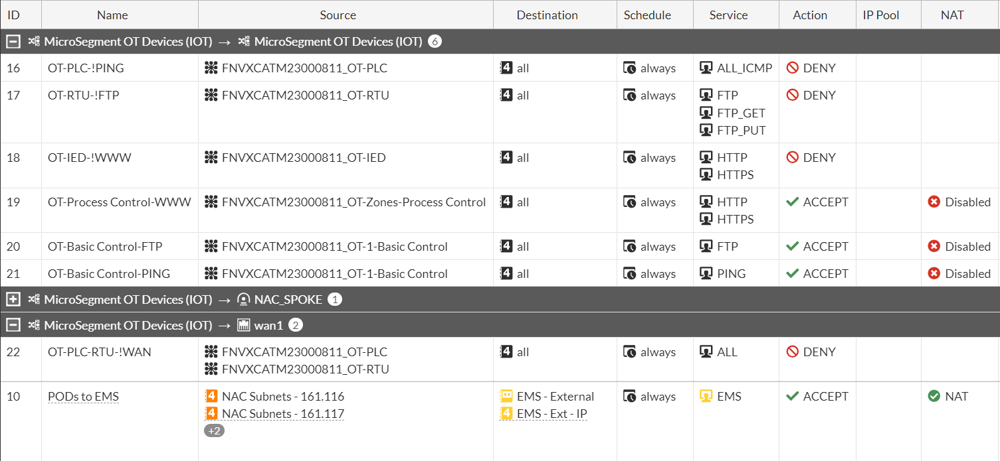{ width=70% }
3. Login to **FortiNAC** and review the policies for OT and the respective vlans.
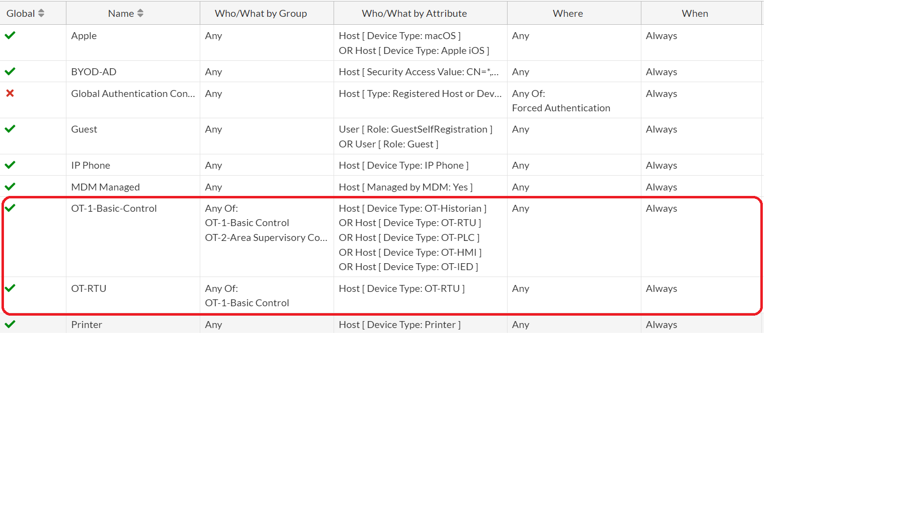{ width=70% }
